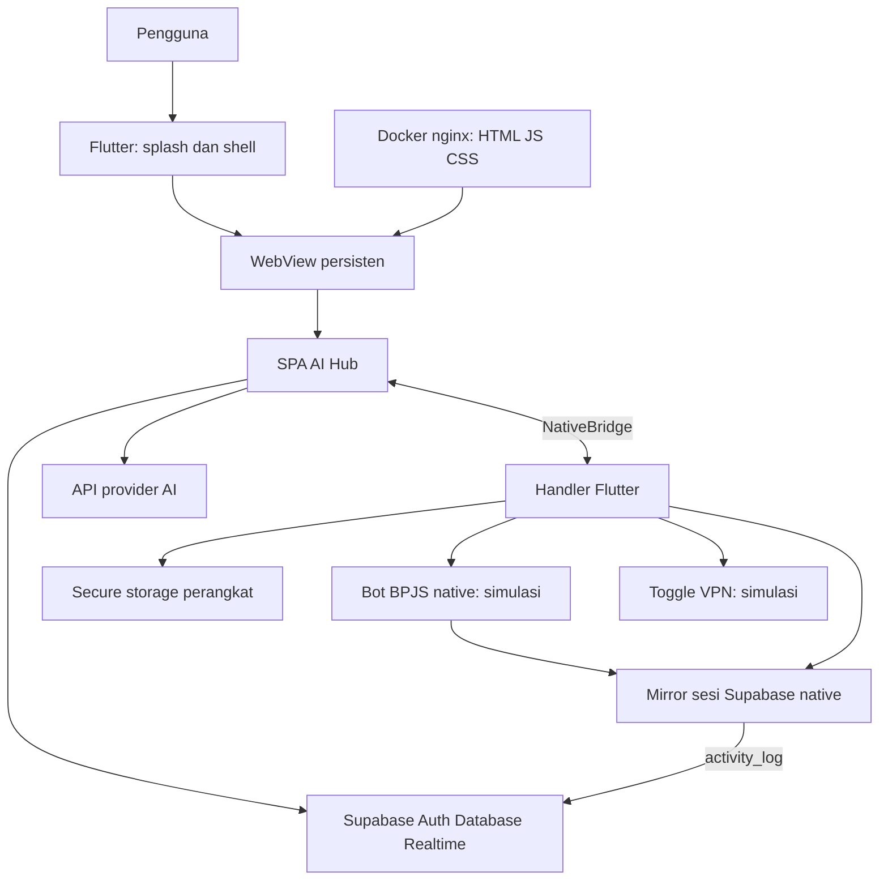
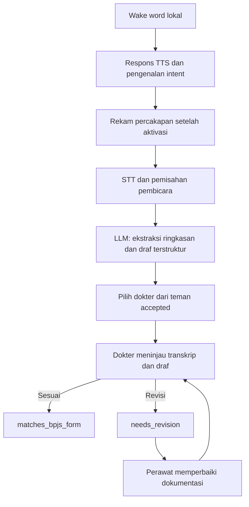
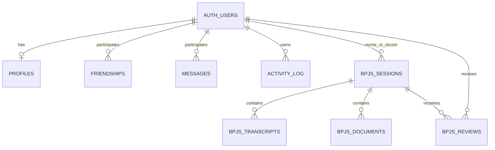

# Progres dan Dokumentasi Lengkap Sistem AI Hub

Tanggal peninjauan: **25 September 2026**. Basis kode yang ditinjau: commit **`0a6e040`**, beserta berkas proyek pada saat penyusunan dokumen.

Dokumen ini menjelaskan tujuan produk, arsitektur, seluruh modul aplikasi, alur data, database, keamanan, konfigurasi, pengoperasian, pengujian, dan pekerjaan lanjutan. Penjelasan implementasi didasarkan pada pembacaan kode lokal. Ketersediaan layanan Supabase, keberhasilan panggilan provider AI, kondisi deployment, dan kemampuan pada perangkat nyata belum diuji dalam penyusunan dokumentasi ini.

**Posisi proyek saat ini:** fondasi aplikasi hybrid Flutter + WebView sudah terbentuk. Autentikasi, profil, pertemanan, pesan langsung, pencatatan aktivitas, penyimpanan kredensial, dan adapter permintaan AI memiliki implementasi. VPN dan eksekusi agent masih simulasi. Bot BPJS sudah memiliki layar native dan rancangan tabel database, tetapi perekaman, STT, diarization, pemrosesan dokumentasi oleh LLM, pengiriman ke dokter, dan penyimpanan sesi klinis belum tersambung.

## Daftar isi

1. [Tujuan dan ruang lingkup produk](#1-tujuan-dan-ruang-lingkup-produk)
2. [Sumber acuan dan cara membaca status](#2-sumber-acuan-dan-cara-membaca-status)
3. [Ringkasan progres implementasi](#3-ringkasan-progres-implementasi)
4. [Struktur direktori dan tanggung jawab berkas](#4-struktur-direktori-dan-tanggung-jawab-berkas)
5. [Teknologi dan dependensi](#5-teknologi-dan-dependensi)
6. [Arsitektur sistem](#6-arsitektur-sistem)
7. [Startup, routing, dan navigasi](#7-startup-routing-dan-navigasi)
8. [Autentikasi, sesi, dan profil pengguna](#8-autentikasi-sesi-dan-profil-pengguna)
9. [Dashboard dan pengaturan](#9-dashboard-dan-pengaturan)
10. [Chat AI dan integrasi provider](#10-chat-ai-dan-integrasi-provider)
11. [Pertemanan dan pesan langsung](#11-pertemanan-dan-pesan-langsung)
12. [Bot Hub dan AI Agent](#12-bot-hub-dan-ai-agent)
13. [Bot BPJS dan Jarvis](#13-bot-bpjs-dan-jarvis)
14. [VPN dan penyimpanan kredensial](#14-vpn-dan-penyimpanan-kredensial)
15. [Kontrak bridge Web dan Flutter](#15-kontrak-bridge-web-dan-flutter)
16. [Database Supabase dan aturan akses](#16-database-supabase-dan-aturan-akses)
17. [Log aktivitas dan pembaruan realtime](#17-log-aktivitas-dan-pembaruan-realtime)
18. [Tampilan dan komponen antarmuka](#18-tampilan-dan-komponen-antarmuka)
19. [Keamanan, privasi, dan batas implementasi](#19-keamanan-privasi-dan-batas-implementasi)
20. [Konfigurasi dan cara menjalankan proyek](#20-konfigurasi-dan-cara-menjalankan-proyek)
21. [Deployment, pembaruan, dan dukungan platform](#21-deployment-pembaruan-dan-dukungan-platform)
22. [Pengujian dan pemeriksaan kualitas](#22-pengujian-dan-pemeriksaan-kualitas)
23. [Pemetaan kebutuhan PRD terhadap kode](#23-pemetaan-kebutuhan-prd-terhadap-kode)
24. [Temuan teknis dan pekerjaan lanjutan](#24-temuan-teknis-dan-pekerjaan-lanjutan)
25. [Evaluasi akademik dan data pengukuran](#25-evaluasi-akademik-dan-data-pengukuran)
26. [Panduan penelusuran masalah](#26-panduan-penelusuran-masalah)
27. [Panduan pengembangan dan pemeliharaan dokumentasi](#27-panduan-pengembangan-dan-pemeliharaan-dokumentasi)

## 1. Tujuan dan ruang lingkup produk

AI Hub adalah aplikasi yang menyatukan beberapa kebutuhan dalam satu antarmuka: percakapan dengan provider AI, komunikasi antar pengguna, katalog bot dan agent, konfigurasi VPN, pengelolaan kredensial, serta riwayat aktivitas.

Produk memiliki dua lingkup yang saling mendukung:

| Lingkup | Tujuan | Pengguna |
|---|---|---|
| Hub AI umum | Mengakses beberapa provider AI, bot, agent, dan konfigurasi koneksi dari satu aplikasi | Pengguna umum, pengembang, pengguna produktivitas |
| Modul akademik Bot BPJS/Jarvis | Mengolah percakapan perawat-pasien menjadi draf dokumentasi pendukung verifikasi dokter | Perawat dan dokter |

Dalam PRD gabungan, infrastruktur akun, pertemanan, chat, dan logging digunakan sebagai fondasi modul akademik. Studi kasus yang disebut dalam PRD akademik adalah Rumah Sakit Ahmad Yani Surabaya, pada lingkup Proyek Akhir D3 Teknik Informatika PENS PSDKU Lamongan.

### 1.1 Peran pengguna

| Nilai peran | Makna produk | Kondisi implementasi |
|---|---|---|
| `general` | Pengguna umum | Dapat dipilih pada profil |
| `perawat` | Pembuat sesi percakapan dan dokumentasi pasien | Dapat dipilih; alur klinis khusus perawat belum dihubungkan |
| `dokter` | Penerima dan peninjau dokumentasi | Dapat dipilih; belum ada inbox atau dashboard review khusus dokter |

Peran saat ini merupakan atribut profil yang dapat diubah sendiri. Belum ada verifikasi profesi, persetujuan admin, atau pembatasan seluruh menu berdasarkan peran.

### 1.2 Batas fungsi Bot BPJS

Sesuai cakupan PRD, sistem ditujukan untuk membantu dokumentasi dan penyediaan informasi pendukung. Keputusan klinis akhir berada pada dokter. Status `matches_bpjs_form` berarti dokumen dinyatakan sesuai untuk konteks alur aplikasi, bukan keputusan klaim atau pencairan dana.

Integrasi langsung dengan sistem rumah sakit, rekam medis elektronik, dan sistem klaim BPJS belum ada di kode. Empat field contoh pada layar Bot BPJS juga belum membuktikan kesesuaian terhadap formulir resmi tertentu.

## 2. Sumber acuan dan cara membaca status

### 2.1 Sumber utama

| Sumber | Kegunaan |
|---|---|
| [PRD gabungan AI Hub/Jarvis](../PRD/PRD-AI-Hub-Jarvis-BPJS.md) | Acuan kebutuhan produk umum dan Bot BPJS dalam satu platform |
| [PRD dokumentasi perawat-pasien](../PRD/PRD-Dokumentasi-Percakapan-Perawat-Pasien.md) | Ruang lingkup akademik dan metode evaluasi |
| [PRD hub AI awal](../PRD/PRD-Hub-Multi-Provider-AI-Agent-VPN.md) | Konsep awal chat, agent, VPN, dan arsitektur hybrid |
| [Rincian sistem terdahulu](RINCIAN-SISTEM.md) | Pertimbangan arsitektur dan konteks rancangan sebelumnya |
| [README Flutter](../app/README.md) dan [README web](../web/README.md) | Petunjuk operasional serta penjelasan awal arsitektur |
| [Kode Flutter](../app/lib/main.dart), [kode web](../web/public/app.js), [schema SQL](../app/supabase/schema.sql) | Bukti implementasi aktual |

Untuk pertanyaan **apa yang sudah dibuat**, kode menjadi dasar dokumen ini. Untuk pertanyaan **apa yang ingin dicapai**, PRD menjadi acuan. Beberapa komentar dan README menggambarkan sasaran akhir secara lebih luas daripada implementasi yang ada.

### 2.2 Definisi status

| Status | Arti |
|---|---|
| Implementasi tersedia | Terdapat kode yang menjalankan fungsi atau memanggil layanan sesungguhnya; bukan pernyataan sudah lolos uji integrasi |
| Parsial | Sebagian kebutuhan tersedia, tetapi alur atau batas produk belum terpenuhi |
| Simulasi | Tampilan dan perubahan status menggunakan data contoh, timer, atau respons tetap |
| Schema tersedia | Tabel dan policy SQL didefinisikan; pemakaian oleh aplikasi atau penerapannya di server belum dipastikan |
| Belum tersedia | Tidak ditemukan implementasi terkait dalam berkas proyek yang ditinjau |

Dokumen ini tidak menggunakan persentase penyelesaian karena belum ada bobot pekerjaan dan hasil pengujian yang dapat menjadi dasar penghitungan.

## 3. Ringkasan progres implementasi

| Bagian | Status | Penjelasan |
|---|---|---|
| Splash dan shell Flutter | Implementasi tersedia | Splash, WebView persisten, bottom navigation, tampilan gagal memuat dan retry |
| SPA web | Implementasi tersedia | Sebelas route, hash router, guard sesi, halaman HTML/JS/CSS |
| Login/registrasi | Implementasi tersedia | Supabase email/password; OTP, reset password, dan upgrade anonim belum ada |
| Profil | Implementasi tersedia | Nama, peran, bio; belum ada foto atau verifikasi profesi |
| Pertemanan | Implementasi tersedia | Pencarian, permintaan, penerimaan/penolakan, daftar, subscription realtime |
| Pesan antar pengguna | Implementasi tersedia | Pesan teks 1:1 disimpan ke Supabase |
| Chat provider AI | Parsial | Adapter HTTP tiga provider tersedia; belum diuji terhadap layanan aktual, belum ada streaming dan riwayat persisten |
| API key | Parsial | Penyimpanan native tersedia; UI belum mendukung penghapusan dan pelaporan kegagalan simpan belum andal |
| Konfigurasi VPN | Parsial | Satu konfigurasi perangkat; belum mendukung konfigurasi terpisah per protokol |
| Tunnel VPN/SSH | Simulasi | Native hanya membalas nilai `connected`; lalu lintas tidak dialihkan |
| Katalog bot dan agent | Implementasi tersedia | Pencarian dan filter katalog statis |
| Eksekusi agent | Simulasi | Urutan teks dengan timer, tanpa framework atau proses tugas nyata |
| Bot FAQ/Penerjemah | Belum tersedia | Kartu katalog berstatus segera tersedia |
| Bot BPJS native | Simulasi | Urutan tahap, dokter contoh, field contoh, tombol review lokal |
| Database Bot BPJS | Schema tersedia | Empat tabel klinis beserta policy RLS |
| STT, diarization, TTS, wake word | Belum tersedia | Belum ada engine, plugin, worker, atau endpoint pemrosesan |
| Log aktivitas | Parsial | Insert dan viewer realtime ada; log simulasi bercampur dengan aktivitas nyata |
| Infrastruktur web | Implementasi tersedia | Docker image nginx dan Compose pada port host 8090 |
| Pengujian | Parsial | Dua widget test native; belum ada pengujian integrasi web/backend/perangkat |
| Kesiapan produksi | Belum terverifikasi | Penguatan keamanan, signing, integrasi native, dan uji layanan masih diperlukan |

## 4. Struktur direktori dan tanggung jawab berkas

```text
PROJECT MOBILE APP/
├── app/                         Aplikasi Flutter dan scaffold platform
│   ├── lib/
│   │   ├── main.dart            Entry point, inisialisasi, route native
│   │   ├── theme.dart           Tema dan token warna Flutter
│   │   ├── screens/
│   │   │   ├── splash_screen.dart
│   │   │   ├── web_shell_screen.dart
│   │   │   └── bot_bpjs_screen.dart
│   │   ├── services/
│   │   │   ├── ai_provider_service.dart
│   │   │   ├── vpn_config_service.dart
│   │   │   ├── supabase_service.dart
│   │   │   └── web_hub_config.dart
│   │   └── widgets/hub_ui.dart
│   ├── supabase/schema.sql      Delapan tabel dan RLS
│   ├── test/widget_test.dart    Pengujian widget native
│   ├── android/ dan ios/        Konfigurasi platform mobile
│   ├── web/                    Scaffold target Flutter web
│   ├── windows/, macos/, linux/ Scaffold desktop
│   ├── pubspec.yaml            Versi aplikasi dan dependensi
│   └── analysis_options.yaml   Konfigurasi analyzer
├── web/                        SPA yang dimuat shell Flutter
│   ├── public/
│   │   ├── index.html          Dokumen utama, font, SDK CDN
│   │   ├── app.js              Registrasi route dan event auth
│   │   ├── router.js           Hash router dan lifecycle view
│   │   ├── bridge.js           Kontrak request/reply ke native
│   │   ├── db.js               Operasi Supabase
│   │   ├── ai.js               Adapter API provider AI
│   │   ├── supabase-config.js  URL proyek dan publishable key
│   │   ├── ui.js               Helper DOM, header, toast, logo
│   │   ├── style.css           Desain dan responsivitas
│   │   └── views/              Sebelas halaman aplikasi
│   ├── Dockerfile
│   ├── docker-compose.yml
│   ├── nginx.conf
│   └── README.md
├── PRD/                        Tiga dokumen kebutuhan
├── docs/
│   ├── RINCIAN-SISTEM.md
│   └── Progres.md              Dokumen ini
└── .gitignore
```

`web/` di akar repository dan `app/web/` memiliki fungsi berbeda. Direktori akar `web/` adalah aplikasi web aktif yang disajikan nginx. `app/web/` adalah scaffold keluaran target Flutter web; kontainer nginx tidak menyalin direktori tersebut.

### 4.1 Layanan native

| Berkas | Tanggung jawab | Tidak ditangani |
|---|---|---|
| `ai_provider_service.dart` | Enum provider, konversi ID, simpan/baca/cek API key | Permintaan chat HTTP |
| `vpn_config_service.dart` | Model config dan penyimpanan JSON secure storage | Membuka tunnel atau memantau jaringan |
| `supabase_service.dart` | Inisialisasi client, mirror sesi, logout, insert aktivitas | UI login, layanan sesi klinis |
| `web_hub_config.dart` | Menentukan URL konten WebView | Deployment kontainer dan pengamanan navigasi |

## 5. Teknologi dan dependensi

Versi berikut adalah **deklarasi dalam repository**, bukan rekomendasi versi terbaru atau bukti versi yang telah terpasang pada mesin pengembang.

| Komponen | Deklarasi | Pemakaian |
|---|---|---|
| Nama paket Flutter | `ai_hub` | Identitas paket Dart |
| Versi aplikasi | `1.0.0+1` | Nama versi dan build number |
| Dart SDK | `^3.13.3` | Batas versi SDK dalam `pubspec.yaml` |
| Flutter | SDK Flutter | UI native dan integrasi platform |
| `cupertino_icons` | `^1.0.8` | Aset ikon |
| `supabase_flutter` | `^2.17.2` | Client Supabase native |
| `http` | `^1.2.2` | Tercantum; panggilan chat aktif saat ini menggunakan `fetch` di web |
| `flutter_secure_storage` | `^9.2.2` | Penyimpanan kredensial perangkat |
| `webview_flutter` | `^4.14.1` | WebView shell |
| `flutter_test` | SDK Flutter | Widget test |
| `flutter_lints` | `^6.0.0` | Lint Dart/Flutter |
| Supabase JS | CDN `@supabase/supabase-js@2` | Auth, query PostgreSQL melalui API, realtime |
| JavaScript | ES modules tanpa framework | Routing dan seluruh halaman web |
| nginx | Image `nginx:1.27-alpine` | Server berkas statis |
| Docker Compose | Satu service `web` | Build dan menjalankan web layer |
| Java/Kotlin Android | Target JVM 17 | Konfigurasi build Android |

Tidak ditemukan dependensi aktif untuk mikrofon, STT, diarization, TTS, wake word, VPN native, push notification, atau framework agent. Direktori web tidak memiliki pipeline npm/bundler; berkas publik disajikan langsung.

## 6. Arsitektur sistem

### 6.1 Pembagian komponen



Flutter bertanggung jawab terhadap shell aplikasi dan layanan perangkat yang sudah disambungkan. Web menangani hampir seluruh antarmuka serta permintaan data. Supabase menjadi layanan eksternal untuk akun, database, dan realtime. Provider AI menerima permintaan langsung dari halaman web.

Tidak ada server aplikasi AI Hub khusus yang memproses chat, menjalankan agent, atau mengolah audio di repository. Kontainer nginx hanya melayani berkas statis; ia bukan proxy API provider dan bukan worker pemrosesan klinis.

### 6.2 Batas native dan web

| Pekerjaan | Komponen aktif |
|---|---|
| Splash, bottom navigation, layar Bot BPJS | Flutter |
| Login dan sesi utama | Supabase JS di WebView |
| Query profil, teman, pesan, log | `web/public/db.js` |
| Form API key dan config VPN | Halaman web |
| Persistensi API key dan config VPN | `FlutterSecureStorage` melalui bridge |
| Panggilan provider AI | `web/public/ai.js` |
| Penulisan log dari Bot BPJS | Supabase native menggunakan mirror sesi |
| Status VPN | State halaman dan respons simulasi native |

Satu WebView dipertahankan ketika pengguna berpindah tab. Namun, setiap route melakukan render view baru; state lokal milik view sebelumnya tidak otomatis bertahan. Karena itu, WebView persisten tidak sama dengan riwayat chat persisten.

### 6.3 Lokasi data

| Data | Lokasi saat ini | Masa hidup atau batas |
|---|---|---|
| API key | Secure storage dengan kunci per provider | Bertahan antar sesi aplikasi; tidak terikat ID akun |
| Config VPN | Secure storage pada kunci `vpn_config` | Satu config untuk perangkat |
| Sesi utama | Dikelola Supabase JS | Tidak ada adapter penyimpanan sesi native khusus pada `db.js` |
| Mirror sesi | Client Supabase Flutter | Dipulihkan dari refresh token web |
| Profil, teman, pesan, log | Tabel Supabase | Bergantung penerapan schema dan keberhasilan query |
| Chat AI | Array `aiMessages` dalam view | Hilang saat view dibuat ulang atau halaman dimuat ulang |
| Bantuan AI dalam chat teman | `Map` lokal `aiEchoByPeer` | Tidak dikirim sebagai pesan ke teman; hilang saat view dibuat ulang |
| Status koneksi VPN | Variabel lokal halaman | Dimulai kembali sebagai disconnected saat render baru |
| Tahap/dokter/verdict Bot BPJS | State widget | Tidak disimpan sebagai data klinis |
| Audio/transkrip/dokumen klinis | Belum ditulis aplikasi | Baru tersedia rancangan tabel untuk sebagian data |

## 7. Startup, routing, dan navigasi

### 7.1 Urutan startup

1. `main()` memanggil `WidgetsFlutterBinding.ensureInitialized()`.
2. Aplikasi mencoba menginisialisasi Supabase native. Exception ditangkap supaya kegagalan mirror tidak langsung menggagalkan peluncuran. Proses ini tetap di-`await`; tidak ada timeout eksplisit pada fungsi startup.
3. `AiHubApp` membuat `MaterialApp` bertema bersama, tanpa debug banner.
4. Route `/` menampilkan `SplashScreen` selama sekitar 1.200 milidetik.
5. Timer melakukan `pushReplacementNamed('/shell')`.
6. `WebShellScreen` membentuk satu `WebViewController`, mengaktifkan JavaScript, memasang `NativeBridge`, dan memuat `WebHubConfig.baseUrl`.
7. `index.html` memuat SDK Supabase dari CDN dan menjalankan `app.js` sebagai module.
8. Router web membuka route hash aktif, dengan fallback `/home`.
9. Guard memeriksa sesi: tanpa sesi diarahkan ke `/login`; pengguna bersesi yang membuka `/login` diarahkan ke `/home`.

### 7.2 Daftar route web

| Route hash | Berkas view | Fungsi |
|---|---|---|
| `#/login` | `login.js` | Masuk dan daftar |
| `#/home` | `home.js` | Ringkasan provider dan pintasan |
| `#/chat` | `chat.js` | Chat AI dan pesan teman |
| `#/bots` | `bots.js` | Katalog bot dan agent |
| `#/friends` | `friends.js` | Daftar, permintaan, pencarian |
| `#/vpn` | `vpn.js` | Status simulasi koneksi |
| `#/vpn-config` | `vpn-config.js` | Form server dan kredensial |
| `#/settings` | `settings.js` | Menu pengaturan dan logout |
| `#/settings/profile` | `profile.js` | Nama, peran, bio |
| `#/settings/apikeys` | `apikeys.js` | API key tiga provider |
| `#/settings/activity` | `activity.js` | Riwayat aktivitas |

Hanya `/login` yang dinyatakan sebagai public route. Path tidak dikenal menggunakan renderer fallback; URL tidak otomatis dinormalisasi menjadi fallback tersebut.

### 7.3 Bottom navigation native

| Tab | Route | Pengelompokan subhalaman |
|---|---|---|
| Home | `/home` | Fallback highlight |
| Chat | `/chat` | Percakapan |
| Bot | `/bots` | Katalog |
| VPN | `/vpn` | Path yang diawali `/vpn`, termasuk config |
| More | `/settings` | Path `/settings...` dan `/friends` |

Flutter mengubah `location.hash` ketika tab ditekan. Web mengirim `route_changed` untuk memperbarui highlight native. Bottom navigation disembunyikan saat path masih kosong atau bernilai `/login`.

### 7.4 Pencegahan render bertumpuk

Event auth dapat memicu beberapa render asinkron dalam waktu berdekatan. `router.js` menggunakan `renderToken` dan kontainer DOM terpisah untuk setiap percobaan render. Hanya percobaan terbaru yang boleh mengganti isi `#app`. Hasil render lama dibuang dan fungsi `dispose()` dipanggil bila tersedia.

View yang digantikan dapat melepas subscription melalui `dispose()`. Jika render melempar exception, router menampilkan pesan kegagalan dan tombol muat ulang. Mekanisme ini melindungi penggantian halaman, tetapi belum otomatis melindungi seluruh operasi asinkron di dalam halaman, misalnya pergantian peer saat query pesan masih berjalan.

### 7.5 Kondisi gagal memuat

Shell memiliki state `loading`, `ready`, dan `failed`. `onPageFinished` menandai ready; `onWebResourceError` menandai failed. Tampilan gagal menyediakan tombol retry yang memanggil `reload()`.

Belum ada bundel halaman lokal, cache offline khusus, antrean sinkronisasi, atau menu native alternatif untuk kredensial/VPN saat web gagal. Handler error juga belum membedakan kegagalan dokumen utama dan resource tambahan.

## 8. Autentikasi, sesi, dan profil pengguna

### 8.1 Login dan registrasi

Layar login memiliki dua mode: masuk dan buat akun. Validasi lokal memastikan email mengandung `@` dan kata sandi minimal enam karakter. Validasi ini sederhana; keputusan autentikasi tetap dari Supabase.

`signInWithEmail()` memanggil `signInWithPassword`, sedangkan `signUpWithEmail()` memanggil `signUp`. Jika registrasi menghasilkan akun tanpa sesi, UI meminta pengguna memeriksa email konfirmasi. Jika sesi tersedia, pengguna diarahkan ke Home. Pesan error layanan ditampilkan pada elemen alert.

Belum ada login OTP, OAuth, lupa kata sandi, penggantian email/password, penghapusan akun, atau alur konversi akun anonim. Guard menganggap keberadaan sesi sebagai logged-in; ia belum memeriksa tipe akun anonim secara khusus.

### 8.2 Mirror sesi ke Flutter

Pada event auth, web merender ulang route dan, jika tersedia, mengirim `refresh_token` melalui `session_changed`. Native menjalankan `SupabaseService.restoreSession()` yang menggunakan `client.auth.setSession(refreshToken)`.

Tujuannya agar log dari Bot BPJS memakai identitas akun yang sama dengan web. UI native tidak melakukan login kedua. Pemulihan sesi bersifat best-effort: error ditangkap dan tidak ditampilkan.

Saat pengguna menekan Keluar, halaman Settings memanggil logout web lalu `Native.signOut()` untuk membersihkan mirror. Event auth yang tidak memiliki refresh token tidak sendiri mengirim perintah pembersihan mirror; kasus sesi berakhir di luar tombol logout perlu diuji.

### 8.3 Profil

Profil memuat `display_name`, `role`, dan `bio`, dengan UUID akun sebagai ID. Email ditampilkan dari objek pengguna Auth, bukan disimpan sebagai kolom profil. Avatar menggunakan huruf pertama nama/email.

Penyimpanan menggunakan upsert. Nama wajib tidak kosong pada UI; role dipilih dari tiga nilai yang ditetapkan; bio opsional. Instansi dan spesialisasi dapat ditulis sebagai bio, tetapi belum menjadi kolom terstruktur atau filter pencarian.

Pada halaman Friends, jika profil belum ada, aplikasi membuat nama awal dari bagian email sebelum `@`. Tidak ada trigger SQL yang otomatis membuat profil saat registrasi, sehingga akun baru belum tentu langsung muncul dalam hasil pencarian sebelum profilnya dibuat.

## 9. Dashboard dan pengaturan

### 9.1 Home

Nama sapaan diambil berurutan dari profil, bagian awal email, lalu fallback `Explorer`. Halaman memeriksa keberadaan key untuk OpenAI, Claude, dan Gemini melalui bridge, kemudian menampilkan jumlah provider yang memiliki key.

Label **Terhubung** pada kartu provider saat ini berarti API key tersimpan dan tidak kosong. Label tersebut bukan hasil pemeriksaan validitas key, saldo, izin model, latensi, atau koneksi provider.

Pintasan tersedia ke VPN, Bot Hub, Friends, dan Chat. Dashboard tidak menghitung pekerjaan agent aktif, sesi klinis tertunda, jumlah teman online, atau statistik penggunaan aktual.

### 9.2 Settings

Pengaturan menyediakan lima pintasan: Profil, Kunci API Penyedia AI, Teman, Kredensial VPN, dan Log Aktivitas. Email akun aktif dan tombol Keluar berada di halaman yang sama.

Belum ada pengaturan bahasa, tema gelap, notifikasi, model default, pengelolaan perangkat, ekspor data, atau penghapusan seluruh data lokal.

## 10. Chat AI dan integrasi provider

### 10.1 Alur percakapan AI

1. Saat view dibuka, provider default adalah `openai`, target adalah Asisten AI, dan satu pesan sapaan lokal ditambahkan.
2. Pengguna dapat memilih provider dari dropdown.
3. Kirim menggunakan tombol panah atau Enter. Shift+Enter tetap untuk baris baru.
4. Teks dipangkas; teks kosong atau pengiriman AI yang masih berlangsung diabaikan.
5. Aplikasi mengecek keberadaan key melalui bridge.
6. Pesan pengguna ditambahkan ke `aiMessages`, spinner ditampilkan, dan aktivitas pengiriman dicatat.
7. `sendChat()` mengambil key lagi dari native dan memanggil adapter provider.
8. Adapter mengirim HTTP POST dan menunggu seluruh JSON respons.
9. Teks balasan ditambahkan ke percakapan; error menjadi bubble error.

Pesan ditampilkan sebagai teks yang di-escape, dengan pemeliharaan baris baru melalui CSS. Belum ada renderer Markdown, file lampiran, gambar, suara, streaming token, pembatalan permintaan, atau token/cost meter.

### 10.2 Adapter yang tertulis dalam kode

Nilai endpoint/model berikut mendokumentasikan isi `ai.js` saat ditinjau. Dukungan model dan keberhasilan akses terkini harus diuji terpisah; tidak diperiksa melalui layanan provider pada pekerjaan dokumentasi ini.

| ID provider | Label | Endpoint dalam kode | Model dalam kode |
|---|---|---|---|
| `openai` | OpenAI | `https://api.openai.com/v1/chat/completions` | `gpt-4o-mini` |
| `anthropic` | Claude | `https://api.anthropic.com/v1/messages` | `claude-3-5-haiku-20241022` |
| `gemini` | Gemini | `https://generativelanguage.googleapis.com/v1beta/models/gemini-1.5-flash:generateContent` | `gemini-1.5-flash` pada URL |

| Adapter | Autentikasi | Bentuk data | Pengambilan hasil |
|---|---|---|---|
| OpenAI | Header `Authorization: Bearer ...` | `messages` berisi `role` dan `content` | `choices[0].message.content` |
| Claude | Header `x-api-key`, `anthropic-version: 2023-06-01` | `messages`, `max_tokens: 1024` | `content[0].text` |
| Gemini | Parameter query `key` | `contents`, `parts`, role assistant dipetakan menjadi `model` | Kandidat pertama, part pertama |

Respons HTTP non-OK diterjemahkan menjadi pesan error. Respons tanpa teks memakai `(empty response)`. Tidak ada retry otomatis, request timeout khusus, fallback provider, chunking, atau pembatasan panjang histori.

### 10.3 Konteks dan persistensi

History AI adalah satu array untuk seluruh provider pada satu instance view. Pergantian provider menggunakan histori yang sama. Pesan sapaan lokal pertama juga disertakan sebagai pesan assistant dalam history, sedangkan bubble error dikecualikan.

Belum ada tabel percakapan AI, ID conversation, pemisahan riwayat per provider, atau penyimpanan lintas perangkat. Berpindah route kemudian kembali ke Chat membuat state awal baru.

### 10.4 Ketergantungan layanan

Panggilan dibuat dari JavaScript WebView, sehingga keberhasilan bergantung pada key, jaringan perangkat, izin dan ketersediaan model, format history yang diterima, serta aturan CORS provider. Header CORS milik nginx tidak dapat mengubah aturan CORS endpoint provider.

Di browser biasa, bridge native tidak tersedia. Halaman Chat dapat dibuka dengan sesi Supabase, tetapi adapter AI tidak mendapatkan key melalui mekanisme yang sekarang ada.

## 11. Pertemanan dan pesan langsung

### 11.1 Pencarian dan permintaan pertemanan

Halaman Friends terdiri atas tab Teman, Permintaan Masuk, dan Cari Pengguna. Pencarian menunggu debounce 300 ms, lalu menjalankan `ilike` terhadap `profiles.display_name`, mengecualikan akun sendiri, dan mengambil maksimal 20 profil.

Walaupun placeholder menyebut nama atau username, implementasi belum memiliki kolom username dan tidak mencari email. Profile directory dapat dibaca oleh pengguna yang terautentikasi sesuai policy SQL.

Mengirim permintaan membuat baris `friendships` dengan `requester_id` akun aktif dan `addressee_id` tujuan. Status awal `pending`. Penerimaan mengubahnya menjadi `accepted`; penolakan memakai `blocked`. `updated_at` dikirim dari waktu browser.

Daftar teman hanya menampilkan hubungan accepted. Permintaan masuk hanya menampilkan pending dengan akun aktif sebagai penerima. Daftar permintaan keluar, pembatalan, unfriend, unblock, status online, dan last-active belum tersedia.

### 11.2 Penggabungan profil dan hubungan

`fetchFriendships()` mengambil hubungan yang melibatkan akun, mengumpulkan ID pihak lain, lalu mengambil profil mereka. Hasilnya diberi atribut tambahan `is_incoming` dan `other_profile` untuk kebutuhan UI.

Subscription `watchFriendships()` mendengarkan perubahan pada tabel. Saat ada perubahan yang diterima client, tab aktif dimuat ulang. Subscription dilepas melalui `dispose()` view.

### 11.3 Chat teman

Chat menampilkan chip Asisten AI serta chip teman accepted. Memilih teman memuat semua pesan dua arah antara akun aktif dan peer, diurutkan menurut `created_at`. Tidak ada pagination atau batas query history pada `fetchMessages()`.

`sendMessage()` menulis `sender_id`, `receiver_id`, dan `body` ke Supabase. `watchMessages()` berlangganan event INSERT tabel messages. Parameter peer digunakan dalam nama channel, tetapi belum dipakai sebagai filter event; pesan yang terlihat oleh akun dari percakapan lain juga dapat memicu pemuatan ulang view aktif.

Belum ada lampiran, read receipt, edit/hapus pesan, indikator mengetik, notifikasi push, atau enkripsi end-to-end pesan dalam kode aplikasi.

### 11.4 Bantuan AI saat berbicara dengan teman

Pengguna dapat mengaktifkan switch AI pada percakapan teman. Teks pengguna tetap dikirim terlebih dahulu sebagai pesan biasa. Sesudahnya, jika key tersedia, teks yang baru dikirim diteruskan ke provider AI.

Balasan AI ditampilkan dengan label **AI (hanya kamu yang lihat)** dan disimpan dalam `aiEchoByPeer`. Balasan itu tidak ditulis ke tabel messages dan tidak dikirim ke teman. Permintaan AI hanya menggunakan teks terbaru, bukan seluruh percakapan dengan teman.

Ada batas UI yang perlu diperbaiki: ketika key belum tersedia dalam mode teman, pesan error dimasukkan ke array percakapan Asisten AI sehingga belum tentu terlihat pada percakapan teman yang sedang aktif.

## 12. Bot Hub dan AI Agent

### 12.1 Isi katalog

| Item | Kategori | Perilaku saat dipilih |
|---|---|---|
| Bot BPJS | Bots | Meminta native membuka `BotBpjsScreen` |
| Bot FAQ | Bots | Menampilkan bahwa bot belum tersedia |
| Bot Penerjemah | Bots | Menampilkan bahwa bot belum tersedia |
| Research Agent | Productivity | Menjalankan log simulasi |
| Code Agent | Dev | Menjalankan log simulasi khusus coding |
| Content Agent | Creative | Menjalankan log simulasi |
| Data Agent | Productivity | Menjalankan log simulasi |
| Planner Agent | Productivity | Menjalankan log simulasi |

Katalog merupakan array `ITEMS` statis. Tab filter: Semua, Bots, Productivity, Creative, dan Dev. Pencarian menggunakan judul secara case-insensitive. Bot dan agent berada pada satu halaman dengan filter kategori; belum ada dua menu hub terpisah sebagaimana sasaran PRD gabungan.

### 12.2 Perilaku simulasi agent

`runAgentSimulation()` membuat panel log dan menambahkan teks setiap 220 ms. Code Agent memiliki teks seperti clone repository, pemasangan dependensi, dan tes lolos; agent lain menggunakan langkah workspace, analisis, dan ringkasan.

Teks tersebut bukan hasil proses yang dijalankan. Tidak ada instruksi tugas dari pengguna, worker, framework OpenClaw/Hermes, tool execution, sandbox eksekusi, antrean, pembatalan, atau hasil tugas tersimpan.

Log aktivitas `task completed` dengan badge Success ditulis saat simulasi dimulai. Oleh karena itu, log tersebut tidak dapat digunakan sebagai bukti eksekusi agent atau kelulusan tes sesungguhnya.

## 13. Bot BPJS dan Jarvis

### 13.1 Alur tujuan berdasarkan PRD

Alur yang ditargetkan adalah deteksi lokal “Halo Jarvis”, jawaban TTS, pengenalan intent, aktivasi sesi rekaman, pemrosesan STT dan diarization, pengolahan LLM, pemilihan dokter dari teman accepted, pengiriman draf, lalu verifikasi/revisi oleh dokter.



Diagram ini adalah target pengembangan. Belum terdapat pipeline tersebut yang berjalan dari audio sampai review lintas akun.

### 13.2 State machine yang sudah dibuat

Layar native memakai enum `_Stage` dengan lima nilai:

| State | Pemicu/perilaku saat ini | Kondisi sebenarnya |
|---|---|---|
| `idle` | Tombol “Ucapkan Halo Jarvis” | Menunggu klik, bukan mendengarkan mikrofon |
| `listening` | Setelah tombol ditekan | Delay 700 ms dan indikator proses |
| `recording` | Setelah delay listening | Waveform animasi, tombol Hentikan Sesi |
| `processing` | Setelah sesi dihentikan | Menulis log, delay 900 ms, membuka pemilih dokter |
| `review` | Setelah dokter contoh dipilih | Menampilkan field contoh dan tombol verdict |

Waveform terdiri atas 16 batang dengan tinggi berdasarkan fungsi sinus dan animation controller. Nilainya bukan amplitudo audio.

Dokter yang ditampilkan berasal dari array statis: `dr. Amma Haz`, `dr. Sritrusta`, dan `dr. Wibowo`. Daftar tidak mengambil data `friendships` ataupun `profiles`. Klaim UI bahwa hanya dokter yang berteman yang muncul belum ditegakkan oleh alur preview ini.

### 13.3 Draf dan review preview

Empat field contoh adalah Keluhan utama, Durasi gejala, Riwayat kesehatan, dan Hasil anamnesis. Isi field tetap dari konstanta `_formFields`; bukan hasil input pasien atau model AI.

Label **Draf AI — perlu verifikasi dokter** telah ditampilkan. Pengguna dapat menekan Perlu Perbaikan atau Tandai Sesuai. `_markVerdict()` hanya mengubah state lokal, menulis aktivitas, dan menampilkan snackbar. Tombol review berada dalam sesi pengguna yang sama; belum merupakan tindakan dokter tujuan melalui akun terpisah.

Setelah verdict dipilih, Mulai sesi baru mengembalikan state ke idle dan menghapus dokter serta verdict lokal. Bila pemilih dokter ditutup tanpa memilih, stage tetap processing dan belum tersedia pemulihan alur khusus.

### 13.4 Hubungan dengan database

Bot BPJS saat ini hanya menggunakan `SupabaseService.logActivity()`. Tidak ada pemanggilan insert/read/update tabel `bpjs_sessions`, `bpjs_transcripts`, `bpjs_documents`, atau `bpjs_reviews` dari layar ini.

Log “Dokumentasi dikirim” tidak mengirim dokumen, pesan, atau notifikasi ke dokter. RLS log membatasi pembacaan kepada pemilik log, sehingga dokter contoh juga tidak otomatis dapat melihat aktivitas perawat.

### 13.5 Komponen yang belum tersedia

| Komponen | Kebutuhan lanjutan |
|---|---|
| Wake word | Engine lokal, lifecycle listener, aktivasi eksplisit |
| Mikrofon | Izin platform, recorder, penyimpanan audio, indikator sesi aktual |
| TTS dan intent | Sintesis suara dan pengenalan perintah |
| STT | Endpoint/engine, format audio, hasil segmen dan waktu |
| Diarization | Pemisahan pembicara, pemetaan peran, validasi koreksi |
| LLM klinis | Prompt, schema keluaran, pemeriksaan field, atribusi ke transkrip |
| Dokter tujuan | Query teman accepted yang relevan, pemilihan berdasarkan UUID |
| Pengiriman | Persistensi sesi/dokumen, metadata pasien, inbox/notifikasi |
| Review | Hak dokter tujuan, catatan revisi, status tersimpan dan riwayat versi |
| Data audio | Bucket/penyimpanan, referensi file, retensi, kontrol akses |
| Evaluasi | Dataset, transkrip referensi, timestamp pemrosesan, skrip metrik |

## 14. VPN dan penyimpanan kredensial

### 14.1 API key provider

Key disimpan pada nama `api_key_openai`, `api_key_anthropic`, dan `api_key_gemini`. Operasi baca/tulis/hapus native memiliki timeout tiga detik dan menangkap error agar tidak membuat pemanggil terus menunggu.

`saveApiKey()` memang mendukung penghapusan jika nilai kosong, tetapi form web menolak nilai kosong sehingga fitur hapus belum dapat digunakan dari UI. Form tidak membaca kembali raw key; ia hanya memeriksa keberadaannya, menerima input pengganti, dan membersihkan input setelah penyimpanan.

Penyimpanan gagal dapat tidak terlihat: native menangkap exception, bridge tetap dapat mengembalikan objek sukses kosong, dan web menampilkan toast Saved. Pemeriksaan simpan perlu membaca hasil operasi secara eksplisit pada pengembangan berikutnya.

### 14.2 Model konfigurasi VPN

| Field | Tipe kode | Penjelasan |
|---|---|---|
| `protocol` | String | Pilihan OpenVPN, WireGuard, atau SSH (Termius-style) |
| `host` | String | Hostname/IP server |
| `port` | String | Nilai port dari input, tetap disimpan sebagai string |
| `username` | String | Nama akun server |
| `password` | String | Kata sandi server |

Seluruh objek diserialisasi sebagai JSON ke satu kunci `vpn_config`. `load()` mengembalikan null jika belum tersimpan, gagal dibaca, atau JSON bermasalah. `clear()` tersedia sebagai fungsi native, tetapi belum diekspos lewat bridge/UI.

Form mewajibkan host dan port tidak kosong. Belum ada validasi rentang port, format host, validasi protokol terperinci, import `.ovpn`, konfigurasi key/peer WireGuard, sertifikat, atau key autentikasi SSH. Pilihan label protokol belum berarti konfigurasi tersebut cukup untuk membuka koneksi protokol nyata.

### 14.3 Alur Connect/Disconnect

Saat layar VPN dibuka, state `connected` dimulai false dan config dibaca melalui native. Tanpa config, tombol Connect mengarahkan pengguna ke form server.

Jika config tersedia, Connect memanggil `vpn_connect`. Handler Flutter langsung mengembalikan `{"connected":true}` tanpa menggunakan config atau memanggil plugin jaringan. Disconnect langsung membalas false. Tampilan Host, Protocol, dan Since mengikuti state lokal ini.

Tidak ada tunnel, routing, pemeriksaan IP, reconnect, statistik byte, atau OS VPN service. Halaman sudah memuat keterangan bahwa lalu lintas belum diarahkan. Subscription `vpn_status` disiapkan pada web, tetapi shell belum mengirim event tersebut.

### 14.4 Cakupan akun

Nama kunci storage tidak mengandung UUID pengguna. Logout tidak menghapus API key atau config VPN. Akibatnya, akun berikutnya pada instalasi yang sama dapat menggunakan konfigurasi perangkat sebelumnya melalui bridge. Ini merupakan perilaku kode yang perlu diputuskan secara eksplisit bila aplikasi dipakai bergantian oleh beberapa orang.

## 15. Kontrak bridge Web dan Flutter

### 15.1 Transport

Web mengirim JSON melalui `NativeBridge.postMessage()`. Flutter menerima pesan di `_onBridgeMessage()`, menjalankan handler berdasarkan `type`, lalu mengembalikan hasil memakai JavaScript `window.__nativeReply(id, resultJson)`.

Contoh payload tanpa data rahasia:

```json
{
  "id": "req_1",
  "type": "has_api_key",
  "payload": { "provider": "openai" }
}
```

Contoh hasil untuk permintaan tersebut adalah objek `{"has":true}` yang diserialisasi sebagai string JSON pada argumen callback.

### 15.2 Daftar pesan

| Type | Payload | Hasil/perilaku native |
|---|---|---|
| `get_api_key` | `provider` | `{key: string atau null}` |
| `has_api_key` | `provider` | `{has: boolean}` |
| `save_api_key` | `provider`, `key` | Simpan melalui secure storage, balas `{}` |
| `get_vpn_config` | Kosong | Objek config; jika null native menyerialisasikan sebagai `{}` |
| `save_vpn_config` | Lima field config | Simpan objek, balas `{}` |
| `vpn_connect` | Kosong | `{connected:true}`, simulasi |
| `vpn_disconnect` | Kosong | `{connected:false}`, simulasi |
| `open_bot_bpjs` | Kosong | Balas `{}` lalu push layar native |
| `sign_out` | Kosong | Logout mirror sesi lalu balas `{}` |
| `route_changed` | `path` | Perbarui state navigasi, tanpa reply |
| `session_changed` | `refresh_token` | Pulihkan mirror sesi, tanpa reply |

`open_bot_bpjs` dan `sign_out` dibungkus request/reply pada kode JS walaupun beberapa penjelasan lama menyebutnya fire-and-forget.

### 15.3 Timeout dan kegagalan

`bridge.js` menyimpan request pending dalam Map dengan ID berurutan `req_1`, `req_2`, dan seterusnya. Timeout adalah 8.000 ms. Tidak ada bridge, timeout, exception postMessage, kegagalan parse reply, atau reply dengan field error akan membuat Promise selesai dengan null.

Pemanggil tidak selalu memeriksa null, sehingga no-op dapat tetap diikuti toast sukses. Jenis pesan yang tidak dikenali native tidak diberi jawaban; web baru pulih setelah timeout.

### 15.4 Event native ke web

`window.__nativeEvent(type, payloadJson)` dan `Native.on(type, handler)` mendukung subscription event. `Native.on` mengembalikan fungsi unsubscribe. Saat ini halaman VPN mendaftarkan handler `vpn_status`, tetapi tidak menyimpan fungsi unsubscribe dan tidak memiliki dispose untuk handler tersebut.

Belum ada pengiriman event native aktif di shell, versi bridge, negosiasi capability, validasi schema payload menyeluruh, atau format error yang konsisten.

## 16. Database Supabase dan aturan akses

Sumber schema: [app/supabase/schema.sql](../app/supabase/schema.sql). Berkas ini mendefinisikan ekstensi `pgcrypto`, delapan tabel publik, indeks, RLS, dan pendaftaran beberapa tabel pada publication realtime.

Keberadaan definisi SQL tidak membuktikan schema sudah diterapkan di proyek Supabase yang sedang digunakan. Dokumen ini menjelaskan isi berkas, bukan hasil introspeksi server.

### 16.1 Relasi utama



Diagram menyederhanakan hubungan dua kolom pengguna pada friendships, messages, dan sesi. Kolom serta policy terperinci dijelaskan di bawah.

### 16.2 `profiles`

| Kolom | Tipe/default | Ketentuan |
|---|---|---|
| `id` | uuid | Primary key, FK `auth.users`, cascade delete |
| `display_name` | text | Wajib |
| `role` | text, default `general` | `general`, `perawat`, atau `dokter` |
| `bio` | text | Opsional |
| `created_at` | timestamptz, `now()` | Wajib |

Indeks: `lower(display_name)`. Query aplikasi menggunakan pencarian substring `ilike('%...%')`; keberadaan indeks tersebut tidak otomatis menjamin percepatan untuk pola substring itu.

RLS memperbolehkan semua pengguna authenticated membaca profil. Insert dan update dibatasi ke ID akun sendiri. Tidak ada policy delete client. Role dapat diubah oleh pemilik profil; policy klinis tidak memverifikasi profesi melalui kolom ini.

### 16.3 `friendships`

| Kolom | Tipe/default | Ketentuan |
|---|---|---|
| `id` | uuid, `gen_random_uuid()` | Primary key |
| `requester_id` | uuid | FK pengguna pengirim, wajib |
| `addressee_id` | uuid | FK pengguna penerima, wajib |
| `status` | text, `pending` | `pending`, `accepted`, `blocked` |
| `created_at` | timestamptz, `now()` | Waktu dibuat |
| `updated_at` | timestamptz, `now()` | Diubah secara eksplisit oleh client |

Constraint melarang permintaan ke diri sendiri dan membuat pasangan `(requester_id, addressee_id)` unik. Pasangan berlawanan arah belum dinormalisasi, sehingga A→B dan B→A dapat menjadi dua baris berbeda. Terdapat indeks untuk masing-masing kolom pengguna.

RLS SELECT/UPDATE memperbolehkan kedua pihak. INSERT hanya mensyaratkan akun sebagai requester. Belum ada policy khusus yang memastikan hanya penerima dapat menerima permintaan, status insert harus pending, atau transisi status tertentu saja yang valid. Tidak ada policy delete.

### 16.4 `messages`

| Kolom | Tipe/default | Ketentuan |
|---|---|---|
| `id` | uuid, `gen_random_uuid()` | Primary key |
| `sender_id` | uuid | FK pengguna pengirim |
| `receiver_id` | uuid | FK pengguna penerima |
| `body` | text | Wajib; SQL belum memeriksa panjang atau teks kosong |
| `created_at` | timestamptz, `now()` | Waktu pesan |

Constraint melarang pesan ke diri sendiri. Indeks percakapan memakai `least(sender_id, receiver_id)`, `greatest(...)`, dan waktu agar pasangan dua arah dapat dikelompokkan.

RLS SELECT dibatasi kepada pengirim/penerima. INSERT memastikan sender adalah akun aktif. **Policy tidak mensyaratkan pertemanan accepted**; pembatasan pilihan penerima sebagai teman baru dilakukan oleh UI. Tidak ada policy update/delete client.

### 16.5 `activity_log`

| Kolom | Tipe/default | Ketentuan |
|---|---|---|
| `id` | uuid, `gen_random_uuid()` | Primary key |
| `user_id` | uuid | FK pemilik log |
| `category` | text | `AI`, `Agents`, `Bots`, `VPN`, `Friends`, `System` |
| `title` | text | Wajib |
| `subtitle` | text | Opsional |
| `badge` | text, `Info` | `Success`, `Info`, atau `Error` |
| `created_at` | timestamptz, `now()` | Waktu insert |

Indeks `(user_id, created_at desc)` mendukung tampilan aktivitas terbaru milik akun. SELECT dan INSERT hanya untuk pemilik. Tidak ada policy UPDATE/DELETE sehingga log append-only dari client biasa.

Log tetap ditulis oleh client dan belum membuktikan kejadian domain secara independen. Tidak ada `session_id`, metadata JSON terstruktur, waktu mulai/selesai proses, ataupun korelasi request.

### 16.6 `bpjs_sessions`

| Kolom | Tipe/default | Ketentuan |
|---|---|---|
| `id` | uuid, `gen_random_uuid()` | Primary key |
| `perawat_id` | uuid | FK akun pembuat sesi, wajib |
| `dokter_id` | uuid | FK akun tujuan, wajib sejak insert |
| `pasien_nama` | text | Wajib |
| `status` | text, `recording` | `recording`, `processing`, `sent`, `pending_review`, `needs_revision`, `matches_bpjs_form` |
| `created_at` | timestamptz, `now()` | Waktu dibuat |
| `updated_at` | timestamptz, `now()` | Belum ada trigger pembaruan otomatis |

Perawat dan dokter tidak boleh akun yang sama. Indeks tersedia untuk perawat/waktu dan dokter/waktu.

SELECT dan UPDATE diizinkan kepada kedua pihak. INSERT mensyaratkan akun aktif sebagai perawat dan adanya hubungan accepted dengan dokter tujuan. Policy belum memeriksa role profesi atau urutan status.

`dokter_id` wajib sejak insert, sedangkan preview memilih dokter setelah tahap pemrosesan. Integrasi nanti perlu memilih dokter lebih awal, menunda insert sesi, atau merancang ulang model draft agar alur dan schema konsisten.

### 16.7 `bpjs_transcripts`

| Kolom | Tipe/default | Ketentuan |
|---|---|---|
| `id` | uuid, `gen_random_uuid()` | Primary key |
| `session_id` | uuid | FK sesi, cascade delete |
| `speaker` | text | `perawat` atau `pasien` |
| `text_segment` | text | Isi segmen, wajib |
| `timestamp_offset_ms` | integer, `0` | Offset milidetik; belum ada check nonnegatif |
| `created_at` | timestamptz, `now()` | Waktu pencatatan |

Indeks `(session_id, timestamp_offset_ms)` mendukung urutan segmen. SELECT mengikuti akses peserta sesi. INSERT hanya oleh perawat pemilik sesi. Tidak ada policy UPDATE/DELETE, sehingga penyuntingan transkrip belum didukung policy yang tersedia.

### 16.8 `bpjs_documents`

| Kolom | Tipe/default | Ketentuan |
|---|---|---|
| `id` | uuid, `gen_random_uuid()` | Primary key |
| `session_id` | uuid | FK sesi |
| `ringkasan` | text | Opsional |
| `dokumentasi_terstruktur` | jsonb, `{}` | Wajib, struktur isi belum divalidasi schema SQL |
| `alur_percakapan` | jsonb, `[]` | Wajib, isi timeline |
| `generated_by_llm_provider` | text | Label provider, opsional |
| `created_at` | timestamptz, `now()` | Waktu dibuat |
| `updated_at` | timestamptz, `now()` | Waktu pembaruan eksplisit |

Indeks tersedia pada session ID. SELECT untuk kedua peserta sesi; INSERT/UPDATE untuk perawat pemilik. Tidak ada constraint unique pada session ID, sehingga satu sesi dapat mempunyai beberapa dokumen. Namun, nomor revisi, status versi, model, prompt version, dan hubungan dokumen-versi belum dimodelkan.

### 16.9 `bpjs_reviews`

| Kolom | Tipe/default | Ketentuan |
|---|---|---|
| `id` | uuid, `gen_random_uuid()` | Primary key |
| `session_id` | uuid | FK sesi |
| `dokter_id` | uuid | FK akun peninjau |
| `verdict` | text | `matches_bpjs_form` atau `needs_revision` |
| `catatan` | text | Catatan revisi/review, opsional |
| `reviewed_at` | timestamptz, `now()` | Waktu review |

SELECT untuk perawat dan dokter yang tercantum pada sesi. INSERT mensyaratkan akun aktif sama dengan dokter pada baris review dan dokter tujuan sesi. Tidak ada policy update/delete; beberapa review dapat disimpan untuk satu sesi.

Belum ada trigger/transaksi yang menyelaraskan insert review dengan status sesi. Penyimpanan verdict dan perubahan status perlu dirancang sebagai operasi konsisten ketika modul dihubungkan.

### 16.10 Ringkasan policy RLS

| Tabel | SELECT | INSERT | UPDATE | DELETE client |
|---|---|---|---|---|
| profiles | Pengguna authenticated | Profil sendiri | Profil sendiri | Tidak ada |
| friendships | Salah satu pihak | Requester sendiri | Salah satu pihak | Tidak ada |
| messages | Pengirim/penerima | Sender sendiri | Tidak ada | Tidak ada |
| activity_log | Pemilik | Pemilik | Tidak ada | Tidak ada |
| bpjs_sessions | Perawat/dokter sesi | Perawat dengan teman accepted | Perawat/dokter sesi | Tidak ada |
| bpjs_transcripts | Peserta sesi | Perawat sesi | Tidak ada | Tidak ada |
| bpjs_documents | Peserta sesi | Perawat sesi | Perawat sesi | Tidak ada |
| bpjs_reviews | Peserta sesi | Dokter tujuan | Tidak ada | Tidak ada |

Policy SELECT/UPDATE berdasarkan partisipasi belum merupakan state machine atau pembatasan kolom. Pergantian identitas peserta dan transisi status perlu dikendalikan lebih ketat. RLS juga tidak sama dengan enkripsi isi data.

### 16.11 Realtime dan migrasi

Publication `supabase_realtime` didaftarkan untuk `activity_log`, `friendships`, `messages`, `bpjs_sessions`, dan `bpjs_reviews`. Transkrip, dokumen, dan profil tidak didaftarkan oleh berkas ini.

Schema memakai `IF NOT EXISTS`, drop/create policy, pemeriksaan publication, serta penambahan kolom/constraint tertentu agar banyak operasi dapat dijalankan ulang. Ini bukan sistem migrasi berversi lengkap: `CREATE TABLE IF NOT EXISTS` tidak otomatis memperbaiki seluruh struktur tabel lama. Tidak ada seed data, migrasi terurut, storage bucket audio, atau fungsi server pemrosesan yang disertakan.

## 17. Log aktivitas dan pembaruan realtime

### 17.1 Sumber log

| Pemicu | Kategori | Isi utama |
|---|---|---|
| Mengirim chat AI utama | AI | Nama provider dan pengiriman pesan |
| Menyimpan API key | AI | Provider, tanpa raw key pada row log |
| Mengirim/menerima/menolak pertemanan | Friends | Nama pihak terkait |
| Menyimpan config VPN | VPN | Protokol, host, port |
| Connect/disconnect simulasi | VPN | Label status dan server |
| Memilih agent | Agents | Klaim selesai dari simulasi |
| Menghentikan preview Bot BPJS | Bots | Label sesi direkam/pemrosesan |
| Memilih dokter preview | Bots | Label dokumentasi dikirim |
| Memberi verdict preview | Bots | Sesuai atau perlu perbaikan |

Belum semua aksi memiliki log: logout, edit profil, semua kegagalan query, penerimaan respons AI, dan pesan langsung tidak otomatis dicatat sebagai peristiwa lengkap.

### 17.2 Viewer

`fetchActivity()` mengambil 100 baris terbaru milik akun. Viewer menggunakan tab All, AI, Agents, VPN, Friends, dan System. Kategori Bots diakui SQL dan dapat muncul pada All, tetapi belum mempunyai tab filter sendiri.

Waktu ditampilkan melalui `toLocaleString()` sesuai lingkungan perangkat. Perubahan INSERT memicu pengambilan ulang daftar. Tidak ada pagination, pencarian, rentang tanggal, ekspor, atau dashboard audit lintas akun.

### 17.3 Reliabilitas pencatatan

Logging native menangkap error; logging web juga dimaksudkan sebagai best-effort. Banyak wrapper Supabase JS tidak memeriksa field `error` yang dikembalikan query, sehingga kegagalan tidak selalu muncul sebagai exception.

Belum ada antrean log offline, retry, atau jaminan bahwa event domain dan baris log tersimpan bersama. Aktivitas simulasi dapat menghasilkan badge Success; pembaca log harus mempertimbangkan sumber kejadian, bukan hanya badge.

## 18. Tampilan dan komponen antarmuka

### 18.1 Tema

Flutter `theme.dart` dan web `style.css` memakai palet latar krem, teks gelap, dan aksen cokelat kemerahan. Token utama mencakup background `#f6f2ea`, surface `#fffcf6`, ink `#23262b`, dan accent `#ad4426`.

Web menggunakan IBM Plex Sans dan IBM Plex Mono dari Google Fonts. Flutter menyebut keluarga font yang sama, tetapi `pubspec.yaml` belum mendaftarkan berkas font; hasil native dapat memakai fallback yang tersedia.

### 18.2 Helper dan widget

| Komponen | Fungsi |
|---|---|
| `h(html)` | Mengubah string HTML menjadi elemen pertama melalui template |
| `header()` | Topbar dan tombol kembali berbasis history browser |
| `toast()` | Pesan singkat sekitar 2,6 detik |
| `initial()` | Inisial avatar |
| `logoSvg()` | Logo kompas web |
| `GradientButton`, `HubCard`, `IconTile` | Kontrol dan kartu native |
| `FilterTabs`, `ProviderMark` | Komponen tab/identitas provider yang tersedia pada library widget |
| `HubLogo`, `_HubLogoPainter` | Logo native |
| `AuroraBackdrop` | Latar splash native |

Sebagian nama widget mempertahankan istilah desain lama; implementasi visual aktual mengikuti tema yang ada, bukan selalu arti literal nama kelasnya.

### 18.3 Responsivitas dan aksesibilitas

Konten web dibatasi lebar maksimum 680 px. Ada breakpoint 480 px dan 360 px; kartu agent/status menjadi lebih sederhana pada layar sempit. Chat menggunakan `100dvh` dengan fallback `100vh`, scroll area pesan, dan input di bagian bawah layout.

Tersedia label ARIA untuk sejumlah input/tombol, `role=log`, `aria-live`, fokus keyboard, target tombol umumnya minimal 44 px, serta CSS `prefers-reduced-motion`. Flutter menggunakan Semantics pada tombol navigasi.

Aksesibilitas belum diuji menyeluruh. `index.html` masih membatasi skala viewport dengan `maximum-scale=1`. Sejumlah halaman juga memakai nama token CSS lama yang tidak didefinisikan, misalnya `--success` dan `--danger`, sementara token aktif adalah `--ok` dan `--bad`.

## 19. Keamanan, privasi, dan batas implementasi

Bagian ini mencatat perilaku dan kesenjangan yang terlihat di kode. Pernyataan tentang kebutuhan data klinis mengikuti rancangan produk, bukan hasil audit kepatuhan atau validasi operasional rumah sakit.

### 19.1 Perlindungan yang tersedia

- Operasi persistensi API key dan config VPN diarahkan ke plugin secure storage perangkat.
- UI API key menggunakan input password dan membersihkan input setelah proses simpan.
- Supabase menggunakan publishable key pada client; definisi RLS tersedia untuk seluruh tabel aplikasi.
- Pesan chat melakukan HTML escaping sebelum ditampilkan.
- Log tidak memiliki policy update/delete untuk client biasa.
- Layar Bot BPJS menampilkan penanda draf yang perlu verifikasi dokter.
- Android memiliki pengecualian HTTP lokal yang dibatasi pada nama `localhost` dalam konfigurasi jaringan.

### 19.2 Raw credential tetap melewati web

`get_api_key` mengembalikan raw key ke JavaScript agar `fetch()` dapat menggunakannya. `get_vpn_config` mengembalikan password dan halaman form memasangnya ke input. Config juga tersimpan dalam variabel view selama view hidup. Refresh token sesi melewati bridge untuk sinkronisasi native.

Dengan demikian, pernyataan bahwa rahasia tidak pernah masuk lapisan WebView tidak sesuai kode. Penyimpanan permanen API key/config diarahkan ke native, tetapi rahasia tetap hadir di memori JavaScript/DOM selama pemakaian. Tidak ada mekanisme zeroization yang menjamin penghapusan memori setelah satu round-trip.

`bridge.js` juga mencatat `payload` pada console warning ketika bridge tidak tersedia atau timeout. Payload save dapat memuat API key/password. Logging debug tersebut perlu disunting agar data rahasia tidak ikut tercetak.

### 19.3 Navigasi dan render HTML

Shell memuat URL awal tertentu, tetapi belum mempunyai `onNavigationRequest` yang memvalidasi origin tujuan atau allowlist domain. Tidak ditemukan certificate pinning ataupun validasi origin per pesan bridge. Mengatur satu `baseUrl` tidak dengan sendirinya membatasi navigasi berikutnya.

Helper `h()` memakai `innerHTML`. Beberapa nilai dinamis, seperti nama profil, bio, nama teman, field config, dan judul log, diinterpolasi langsung tanpa escaping terpusat. Ini menunjukkan permukaan risiko injeksi HTML/XSS, terutama karena halaman mempunyai akses ke bridge kredensial. Belum ada uji eksploitasi pada pekerjaan dokumentasi ini.

Shell juga menyisipkan ID request ke string JavaScript reply tanpa JSON encoding khusus untuk ID tersebut. Validasi payload dan konstruksi callback perlu diperketat bersama pengamanan bridge.

### 19.4 Session storage dan integritas dependensi

`db.js` membuat client dengan konfigurasi default SDK, tanpa adapter yang memaksa penyimpanan sesi ke Keystore/Keychain. Karena itu, belum ada dasar dari kode untuk menyatakan seluruh token autentikasi disimpan melalui secure storage native.

SDK Supabase web dimuat dari CDN pada major version `@2`, tanpa pin versi patch dan tanpa atribut integrity. Ketersediaan halaman bergantung pada resource tersebut. Font juga dimuat dari layanan eksternal. Tidak ada Content Security Policy atau strategi bundling dependensi lokal pada konfigurasi yang ditinjau.

### 19.5 RLS dan aturan bisnis

RLS sudah membatasi pembacaan sebagian besar data berdasarkan identitas peserta, tetapi masih ada celah aturan bisnis: update friendship oleh kedua pihak, pesan tanpa syarat accepted, role profesi yang dipilih sendiri, dan update sesi klinis yang belum dibatasi per field/transisi.

Tidak ditemukan enkripsi end-to-end pesan, enkripsi field klinis pada client, kebijakan bucket audio, retensi, consent recording, atau audit server yang tidak bergantung pada client. Konfigurasi enkripsi dan backup pada layanan Supabase tidak dapat dinilai hanya dari schema lokal.

## 20. Konfigurasi dan cara menjalankan proyek

Perintah berikut adalah panduan operasional berdasarkan struktur repository. Tidak dijalankan sebagai bagian pembuatan dokumen ini.

### 20.1 Prasyarat

- Flutter beserta Dart yang memenuhi batas SDK di `app/pubspec.yaml`.
- Android SDK, JDK yang sesuai, emulator atau perangkat Android, serta `adb` untuk pengujian Android.
- Docker dan Docker Compose untuk web layer.
- Proyek Supabase dengan provider autentikasi email/password dan schema aplikasi.
- Koneksi perangkat ke web server, Supabase, CDN SDK, dan provider AI bila fitur chat AI diuji.
- Lingkungan macOS/Xcode bila akan membangun target iOS.

### 20.2 Menjalankan web layer

Dari akar proyek pada PowerShell:

```powershell
Set-Location 'D:\DOKUMEN\PROJECT MOBILE APP\web'
docker compose up -d --build
docker compose ps
```

Alamat lokal: `http://localhost:8090`. Browser biasa dapat menguji login, profil, pertemanan, pesan, dan log jika Supabase siap. Fitur yang memerlukan NativeBridge tidak mendapatkan layanan native pada browser tersebut. Sebagian UI masih dapat menampilkan toast sukses meskipun bridge tidak tersedia.

### 20.3 Menyiapkan Supabase

1. Tentukan proyek Supabase yang digunakan untuk lingkungan tersebut.
2. Terapkan [schema SQL](../app/supabase/schema.sql) pada proyek yang benar dan periksa hasil eksekusinya.
3. Pastikan autentikasi email/password dikonfigurasi sesuai alur registrasi yang diinginkan.
4. Samakan URL proyek dan publishable key di `web/public/supabase-config.js` serta `app/lib/services/supabase_service.dart`.
5. Verifikasi tabel, RLS, dan publication realtime benar-benar tersedia pada server.
6. Buat akun uji terpisah untuk pengujian pertemanan/pesan dan akses lintas akun.

Kedua client saat ini menyimpan konfigurasi proyek sebagai konstanta dalam kode. Tidak ada pemuatan `.env` atau injeksi konfigurasi runtime dari Compose. Jangan memasukkan service-role/secret key ke client.

### 20.4 Menjalankan Flutter pada Android

```powershell
Set-Location 'D:\DOKUMEN\PROJECT MOBILE APP\app'
flutter pub get
flutter devices
adb reverse tcp:8090 tcp:8090
flutter run
```

Default kode adalah `http://localhost:8090` untuk semua target. Pada Android yang terhubung ke ADB, reverse port memungkinkan localhost perangkat menuju port host. Jika ada beberapa perangkat, pilih serial pada `adb -s <SERIAL> reverse ...` dan gunakan `flutter run -d <DEVICE_ID>`.

Kode tidak otomatis mengganti alamat menjadi `10.0.2.2` pada emulator. Pengecualian HTTP Android yang tersedia juga hanya untuk localhost. Karena itu, keterangan README lama tentang alamat emulator otomatis tidak menggambarkan `WebHubConfig` saat ini.

### 20.5 Mengganti URL WebView

```powershell
flutter run --dart-define=WEB_HUB_URL=https://hub.example.com
```

`WEB_HUB_URL` dibaca melalui `String.fromEnvironment`, sehingga ditetapkan saat build/run Flutter, bukan melalui environment kontainer nginx. Nama domain contoh harus diganti dengan domain deployment yang benar.

### 20.6 Memperbarui dan menghentikan kontainer

Compose tidak memasang volume source. Perubahan pada `web/public/` harus masuk image baru:

```powershell
Set-Location 'D:\DOKUMEN\PROJECT MOBILE APP\web'
docker compose up -d --build
```

Sesudahnya, reload WebView/browser agar dokumen dan module dibaca kembali. Berpindah hash route saja tidak menjamin JavaScript baru sudah terunduh.

Untuk menghentikan kontainer:

```powershell
docker compose down
```

Perintah Compose tersebut mengelola web container; database Supabase merupakan layanan terpisah.

## 21. Deployment, pembaruan, dan dukungan platform

### 21.1 Kontainer web

Dockerfile menyalin `public/` ke `/usr/share/nginx/html/` dan konfigurasi nginx ke `conf.d/default.conf`. Port internal 80 dipetakan ke host 8090. Nama container adalah `ai-hub-web` dengan restart policy `unless-stopped`.

Healthcheck setiap 30 detik memakai `wget` ke `http://127.0.0.1/` dengan timeout tiga detik. Pemilihan IPv4 eksplisit menghindari ketidakcocokan resolusi localhost di container. Healthcheck hanya membuktikan halaman HTTP merespons; tidak menguji JavaScript, Supabase, provider AI, atau bridge.

nginx mempunyai fallback `try_files ... /index.html`, header CORS wildcard, dan aturan no-store khusus `/announcements.json`. File announcements dan fitur pembacanya tidak ditemukan pada web aktif. Aturan tersebut bukan bukti modul pengumuman tersedia.

### 21.2 Pembaruan konten

Perubahan HTML/CSS/JS dapat disajikan dengan redeploy kontainer. Namun, belum ada version manifest, pemeriksaan pembaruan, service worker, asset hash, rollback otomatis, atau handshake kompatibilitas versi bridge.

Perubahan plugin native, izin OS, enum provider yang dikenali Flutter, protokol bridge, dan URL yang ditanam dalam build dapat memerlukan build native baru. Sasaran “build sekali” dalam README adalah motivasi arsitektur, bukan jaminan bahwa seluruh perubahan berikutnya bebas rilis native atau pasti diterima store.

### 21.3 Android

Namespace/application ID adalah `com.aihub.ai_hub`. `MainActivity` masih turunan kosong dari `FlutterActivity`. Manifest utama memiliki izin INTERNET, tetapi belum mendeklarasikan mikrofon atau service VPN.

SDK minimum/target/compile mengikuti nilai Flutter pada konfigurasi Gradle. Build release saat ini memakai signing config debug. Penandatanganan produksi belum dikonfigurasi pada berkas tersebut.

### 21.4 iOS dan desktop

Scaffold iOS tersedia, tetapi `Info.plist` belum mempunyai deskripsi penggunaan mikrofon atau pengecualian HTTP lokal khusus. Integrasi VPN extension dan izin klinis native belum tersedia.

Direktori Windows, macOS, Linux, dan Flutter web tersedia sebagai scaffold. Keberadaan direktori tersebut tidak membuktikan seluruh plugin shell dan fitur aplikasi berfungsi pada setiap target. Tidak ada fallback platform pada `WebShellScreen` ketika membentuk WebViewController.

Bahkan build Flutter web yang berhasil tidak otomatis membuktikan shell WebView dapat digunakan pada browser. SPA akar `web/` adalah jalur browser yang berbeda dan sudah menjadi sumber konten utama.

### 21.5 Pekerjaan deployment yang belum tampak

Repository belum menyertakan reverse proxy TLS, domain produksi, CI/CD, pengelolaan secret deployment, konfigurasi lingkungan staging/production, monitoring error, strategi backup/restore, atau catatan pengujian distribusi store.

## 22. Pengujian dan pemeriksaan kualitas

### 22.1 Test yang tersedia

`app/test/widget_test.dart` memiliki dua test:

| Test | Cakupan |
|---|---|
| Splash shows branding while its timer runs | Nama AI Hub, tagline, dan tidak ada exception selama awal splash |
| Bot BPJS preview runs the full session and review flow | Klik trigger, delay, hentikan sesi, pilih dokter contoh, label draf, tombol sesuai, snackbar batas klaim |

Test memakai mock MethodChannel secure storage. Test splash tidak menunggu navigasi ke shell karena WebView native tidak tersedia pada harness tersebut. Tidak ada test yang benar-benar mengakses mikrofon, VPN, provider AI, atau Supabase.

Komentar awal file menyebut shell chrome sebagai sasaran umum, tetapi dua test aktual belum menguji bottom navigation atau protokol bridge.

### 22.2 Perintah pemeriksaan

Setelah dependensi tersedia, dari `app/`:

```powershell
flutter analyze --no-pub
flutter test --no-pub
```

Analyzer menggunakan `flutter_lints` dan mengecualikan direktori build/platform dari analisis. Pemeriksaan Android/iOS, web JS, SQL, dan perilaku layanan tidak otomatis tercakup oleh analyzer Dart.

README juga mencantumkan `flutter build web --no-pub`. Hasil build tersebut harus dipisahkan dari verifikasi kemampuan runtime shell pada web. Untuk integrasi mobile, diperlukan run/build pada target perangkat yang digunakan.

### 22.3 Cakupan verifikasi saat dokumen dibuat

Penyusunan dokumen meliputi pembacaan kode Flutter, seluruh view dan layanan web, schema SQL, konfigurasi build/container, test yang ada, dan PRD. Tidak ada test runtime yang dijalankan; tidak ada akun dibuat, query produksi dikirim, atau konfigurasi layanan diubah.

Pemeriksaan akhir dokumen diarahkan pada keberadaan berkas, tautan lokal, struktur Markdown, dan kesesuaian penjelasan terhadap source. Tidak ada klaim baru bahwa test proyek telah lulus.

### 22.4 Skenario uji integrasi yang diperlukan

| Area | Skenario yang perlu diverifikasi |
|---|---|
| Auth | Daftar dengan/tanpa konfirmasi email, login salah, sesi kedaluwarsa, logout dua client |
| Bridge | Pesan valid/tidak valid, timeout, storage gagal, native lama, tidak ada bridge |
| Kredensial | Simpan dan baca kembali, restart aplikasi, ganti akun, hapus key/config |
| Chat AI | Key salah, model tidak tersedia, CORS, jaringan putus, history panjang, pindah route saat request aktif |
| Friends | Dua akun, request duplikat dua arah, requester mencoba menerima sendiri, penolakan |
| Pesan | Hanya peserta dapat membaca, kebijakan kirim non-teman, pesan realtime, pergantian peer cepat |
| RLS klinis | Perawat A, dokter tujuan B, pengguna lain C, role palsu, pergantian peserta dan status |
| Bot BPJS | Izin ditolak, pemilih dokter dibatalkan, kegagalan tiap tahap pipeline setelah diimplementasikan |
| VPN | Status tunnel dari OS, putus/reconnect, pergantian protokol setelah plugin tersedia |
| UI | Layar kecil, keyboard, aksesibilitas, font gagal dimuat, navigasi cepat dan logout |
| Deployment | Resource CDN gagal, web server down, konten baru dengan shell lama, pemulihan versi |

## 23. Pemetaan kebutuhan PRD terhadap kode

Nomor kebutuhan pada bagian ini mengikuti **PRD gabungan AI Hub/Jarvis**. Nomor pada PRD akademik mempunyai arti berbeda dan tidak boleh dicampur.

### 23.1 Kebutuhan fungsional

| ID | Kebutuhan ringkas | Status implementasi |
|---|---|---|
| FR-01 | Setup key multi-provider saat onboarding | Parsial: form Settings ada, wizard onboarding tidak ada |
| FR-02 | Pilih provider chat | Implementasi tersedia; request aktual belum diuji |
| FR-03 | Jalankan agent | Simulasi log |
| FR-04 | Koneksi VPN | Simulasi toggle |
| FR-05 | Status VPN realtime | Belum ada status OS; event hanya disiapkan di JS |
| FR-06 | Kredensial lokal terenkripsi | Plugin secure storage dipakai; perilaku perangkat perlu diuji |
| FR-07 | Tambah/edit/hapus kredensial | Parsial: simpan/edit ada, hapus tidak tersedia di UI |
| FR-08 | Log aktivitas Supabase | Parsial: implementasi insert ada, cakupan dan makna simulasi perlu diperbaiki |
| FR-09 | Lihat/filter log realtime | Parsial: viewer 100 baris, kategori Bots belum punya tab |
| FR-10 | Modularitas provider/agent/bot | Parsial: adapter dan katalog terpisah, daftar native masih hardcoded |
| FR-11 | Update konten web dari server | Implementasi tersedia; membutuhkan reload dan kompatibilitas shell |
| FR-12 | Fallback/offline | Parsial: layar error dan retry saja |
| FR-13 | Login/registrasi dan opsi upgrade anonim | Parsial: email/password tersedia, upgrade anonim tidak ada |
| FR-14 | Cari/kirim/terima/tolak pertemanan | Implementasi tersedia; aturan bisnis backend masih perlu diperketat |
| FR-15 | Daftar teman dan status online | Parsial: daftar ada, presence tidak ada |
| FR-16 | Ganti protokol VPN aktif | Parsial pada form; koneksi/transisi protokol belum ada |
| FR-17 | Menu Bot terpisah dari Agent Hub | Parsial: satu katalog gabungan dengan filter Bots |
| FR-18 | Wake word dan TTS | Simulasi tombol dan teks |
| FR-19 | Rekam, STT, diarization, LLM | Simulasi tahap; pipeline belum ada |
| FR-20 | Cocokkan nama dokter ke friend list | Dokter contoh hardcoded; belum ada pencocokan |
| FR-21 | Dokter menerima dokumentasi/notifikasi | Belum ada integrasi |
| FR-22 | Dokter memberi verdict/revisi | UI simulasi dan schema review tersedia, alur lintas akun belum ada |
| FR-23 | Provider pilihan dokter untuk review | Chat umum ada; tidak terhubung ke dokumen BPJS |
| FR-24 | Status kecocokan form BPJS | Enum schema dan teks preview ada; persistensi transisi belum ada |

### 23.2 Kebutuhan nonfungsional

| ID | Sasaran | Temuan |
|---|---|---|
| NFR-01 | Kredensial/token terenkripsi dan tidak diserahkan ke WebView | Parsial: secure storage ada, tetapi raw credential/token melewati web/bridge |
| NFR-02 | Android dan iOS | Scaffold tersedia; verifikasi perangkat lintas platform belum dilakukan |
| NFR-03 | Penambahan provider/bot/protokol modular | Struktur dasar tersedia, beberapa perubahan masih menyentuh native |
| NFR-04 | Reliabilitas VPN | Belum dapat dinilai karena tidak ada tunnel |
| NFR-05 | Kredensial tidak dikirim ke server aplikasi tanpa izin | Jalur aktif menuju storage/provider; potensi console payload rahasia masih ada |
| NFR-06 | Pindah provider tanpa reload | Dropdown mengubah state lokal; belum ada pengukuran performa |
| NFR-07 | Update web tanpa submit native untuk setiap perubahan UI | Struktur mendukung; belum ada pengelolaan versi/kompatibilitas |
| NFR-08 | Fitur inti tetap dapat diakses tanpa WebView | Belum terpenuhi; fallback hanya retry |
| NFR-09 | HTTPS dan allowlist domain bridge | URL bisa HTTPS; allowlist/pinning belum diterapkan |
| NFR-10 | Privasi data klinis | RLS schema ada; audio, retensi, dan bukti konfigurasi enkripsi belum ada |
| NFR-11 | Penjelasan batas AI | Label draf tersedia pada preview |
| NFR-12 | Wake word on-device | Belum tersedia |
| NFR-13 | Audit tiap transisi dan timestamp evaluasi | Log preview tersedia; belum ada audit domain lengkap |
| NFR-14 | Tujuan dokumentasi hanya teman accepted | Diterapkan pada INSERT schema sesi; pemilih dokter aplikasi belum terhubung |

## 24. Temuan teknis dan pekerjaan lanjutan

Daftar ini merupakan hasil pembacaan kode, bukan daftar perubahan yang sudah dikerjakan. Temuan runtime perlu direproduksi pada lingkungan uji sebelum dinyatakan sebagai hasil uji.

### 24.1 Ketidaksesuaian yang memengaruhi kebenaran status

| Temuan | Dampak | Tindak lanjut |
|---|---|---|
| Null reply native diubah menjadi `{}` | Tanpa config VPN, JS menerima objek truthy dan dapat memperlakukan config sebagai tersedia | Tetapkan representasi null yang konsisten dan validasi field wajib |
| Simpan storage menangkap error tanpa status gagal | Toast/key badge dapat menyatakan sukses saat data tidak tersimpan | Kembalikan hasil operasi dan verifikasi baca ulang |
| Wrapper query mengabaikan `error` | Permintaan teman/profil/pesan bisa tampak berhasil meski server menolak | Standarkan penanganan hasil Supabase |
| Log agent langsung menyatakan completed | Audit merekam keberhasilan simulasi sebagai tugas selesai | Tandai mode demo dan gunakan status dari eksekusi aktual |
| VPN state hanya lokal | Connected hilang saat render ulang dan tidak mewakili routing | Gunakan status tunnel native setelah integrasi |
| Dokumen BPJS hanya contoh | Tidak ada dokumen untuk dokter penerima meski teks menyebut terkirim | Sambungkan seluruh persistensi dan pengiriman |
| Pemilih dokter dibatalkan | Spinner processing dapat tetap aktif | Tambahkan transisi batal/kembali yang jelas |

### 24.2 Lifecycle dan UX

| Temuan | Dampak/tindak lanjut |
|---|---|
| `vpn_status` listener tidak dilepas | Tambahkan dispose agar render ulang tidak menumpuk handler |
| Timer simulasi agent tidak dibersihkan | Kelola timer saat view ditutup atau simulasi baru dimulai |
| Query chat bergantung variabel peer yang dapat berubah | Snapshot peer dan abaikan respons usang ketika berpindah percakapan |
| Tidak ada pagination pesan | History panjang dapat membebani query dan render |
| Tanda Saved ditambahkan berulang | Hindari badge duplikat setelah beberapa kali menyimpan key |
| Error key pada chat teman masuk array AI utama | Tampilkan error pada percakapan aktif |
| Filter Bots tidak tersedia pada log | Samakan kategori SQL, logger, dan UI |
| Token CSS lama masih digunakan | Samakan nama token dan periksa kontras warna |
| Gagal resource apa pun menandai shell failed | Bedakan main-frame error dan resource tambahan |

### 24.3 Prioritas pengerjaan yang disarankan

Prioritas berikut adalah usulan berdasarkan dependensi teknis dan tujuan PA, bukan jadwal atau komitmen waktu yang sudah disepakati.

| Urutan | Fokus | Hasil yang diharapkan |
|---|---|---|
| 1 | Keamanan render/bridge, hasil operasi, aturan RLS | Data dan status UI konsisten sebelum integrasi lebih jauh |
| 2 | Uji fondasi auth, profil, teman, pesan, provider AI pada perangkat | Mengetahui bagian integrasi yang benar-benar berfungsi |
| 3 | Sambungkan sesi BPJS, dokter aktual, dokumen, inbox, review | Alur perawat-dokter dapat diuji dengan teks sebelum audio |
| 4 | Rekaman audio, STT, diarization, LLM terstruktur | Pipeline dokumentasi nyata dari percakapan |
| 5 | Wake word, TTS, pengenalan intent | Pengoperasian hands-free sesuai rancangan Jarvis |
| 6 | Dataset dan pengukuran akademik | Hasil eksperimen yang dapat dipertanggungjawabkan |
| 7 | Agent/VPN nyata sesuai prioritas produk | Fitur umum menggantikan simulasi dengan eksekusi aktual |
| 8 | Offline, observabilitas, deployment dan distribusi | Pengoperasian yang lebih stabil dan terukur |

## 25. Evaluasi akademik dan data pengukuran

PRD akademik membandingkan baseline berupa transkripsi STT saja dengan metode usulan STT + LLM untuk ekstraksi, ringkasan, dan dokumentasi terstruktur. Kedua konfigurasi perlu menggunakan skenario percakapan dan kondisi masukan yang sama.

| Metrik | Yang dinilai | Data yang diperlukan |
|---|---|---|
| Word Error Rate (WER) | Kesalahan transkripsi | Transkrip referensi dan keluaran STT |
| Kelengkapan informasi | Field penting yang berhasil tercakup | Rubrik informasi wajib dan hasil dokumentasi |
| Kesesuaian isi | Kesesuaian draf dengan percakapan | Audio/transkrip sumber dan penilaian reviewer |
| Factual consistency | Informasi yang tidak didukung percakapan | Anotasi fakta dan keluaran LLM |
| Waktu pemrosesan | Durasi tiap tahap dan total | Timestamp mulai/selesai rekam, STT, diarization, LLM, dan review |

Formula umum WER adalah `(substitusi + penghapusan + penyisipan) / jumlah kata referensi`. Angka tersebut belum dihitung oleh aplikasi.

Belum ada dataset, skrip evaluasi, anotasi ground truth, penyimpanan audio, pencatat durasi tahap, atau hasil eksperimen. `created_at` log saat ini bukan pengganti pengukuran durasi proses, terutama karena proses masih memakai delay simulasi.

Untuk eksperimen yang dapat diulang, catat versi model STT/LLM, konfigurasi diarization, prompt, rubrik penilaian, ID skenario, kondisi audio, dan versi aplikasi. Schema saat ini baru mempunyai label provider pada dokumen; detail eksperimen perlu ditambahkan secara terencana.

## 26. Panduan penelusuran masalah

| Gejala | Pemeriksaan awal | Penjelasan terkait kode |
|---|---|---|
| Shell “Tidak bisa memuat AI Hub” | Container, port 8090, ADB reverse, URL build | Konten dimuat dari server, tidak ada halaman offline lokal |
| Browser hanya menampilkan spinner | Console dan pemuatan SDK CDN/module | SDK global diperlukan sebelum `db.js` dapat berjalan |
| Registrasi berhasil tetapi belum masuk | Status konfirmasi email Supabase | Tanpa session, UI meminta konfirmasi |
| Akun tidak ditemukan saat dicari | Row profiles dan display_name | Tidak ada trigger profil otomatis saat daftar |
| Permintaan teman seolah sukses tetapi tidak muncul | Hasil error query dan constraint pasangan | Wrapper belum melempar semua error Supabase |
| Pesan tidak realtime | Publication messages, subscription, RLS | Query awal dan subscription adalah jalur berbeda |
| Semua provider belum terhubung di browser | Keberadaan NativeBridge | Browser biasa tidak mempunyai secure storage Flutter |
| Key dianggap tersimpan tetapi chat gagal | Baca ulang key, key valid, endpoint/model, CORS | Saved/Connected bukan hasil validasi provider |
| Tidak ada config tetapi VPN terlihat mempunyai server | Bentuk hasil `get_vpn_config` | Null berubah menjadi objek kosong truthy |
| VPN Connected tetapi IP tidak berubah | Status implementasi tunnel | Toggle masih simulasi dan tidak mengubah routing |
| Dokter tidak menerima hasil Bot BPJS | Jalur insert klinis/pesan | Preview hanya mencatat aktivitas milik akun sendiri |
| Bot terhenti setelah sheet dokter ditutup | State processing | Pembatalan belum memulihkan state |
| Log Bot tidak ada di filter | Pilih All | Tab Bots belum tersedia |
| Perubahan web tidak terlihat | Rebuild container dan reload WebView | Tidak ada volume source atau pemeriksaan versi otomatis |
| Flutter gagal karena SDK | Cocokkan `flutter --version` dengan pubspec | Batas Dart mengikuti deklarasi proyek |
| Test lolos tetapi shell tidak berfungsi | Jalankan integrasi perangkat | Widget test tidak menjalankan WebView/provider/VPN |

## 27. Panduan pengembangan dan pemeliharaan dokumentasi

### 27.1 Menambah fitur

| Jenis perubahan | Lokasi yang perlu diperiksa |
|---|---|
| Halaman web | Buat view, daftarkan di `app.js`, kelola dispose, atur navigasi dan CSS |
| Provider AI | `PROVIDERS`, adapter `ai.js`, enum/pemetaan native, storage dan form key |
| Bot atau agent | Katalog `ITEMS`, handler eksekusi, status pekerjaan, layanan persistensi |
| Aksi native | Wrapper bridge JS, handler Flutter, validasi payload, hasil/error, izin platform |
| Data baru | Schema/migrasi, policy RLS, indeks, query, pengujian lintas akun |
| Data klinis | Identitas sesi/dokter, kontrol akses, versi dokumen, audit, metadata evaluasi |
| Deployment | Container/static assets, URL build, kompatibilitas bridge, reload dan pemulihan versi |

Penambahan provider saat ini tidak cukup dengan update array web karena native hanya mengenali tiga ID. Jika ID baru tidak dikenali, operasi key tidak menyimpan key provider tersebut. Menambah provider baru memerlukan perubahan native atau perancangan penyimpanan/registri provider yang lebih dinamis.

### 27.2 Koreksi pemahaman dari dokumen lama

| Pernyataan yang perlu diperjelas | Kondisi kode saat ini |
|---|---|
| Seluruh aplikasi masih UI preview native | Banyak UI sudah berada di SPA web dan mempunyai query/panggilan API aktual |
| Hybrid sudah diimplementasikan penuh, termasuk seluruh fungsi sensitif | Shell dan bridge tersedia; mic, wake word, TTS, dan tunnel belum ada |
| WebView memakai satu domain yang sudah di-whitelist | Ada URL awal, tetapi belum ada validasi navigasi/origin eksplisit |
| Token dan key tidak pernah masuk web | Raw key, config password, dan refresh token melewati konteks web/bridge |
| Semua riwayat chat tersimpan | Pesan antar pengguna tersimpan; history AI masih state lokal |
| Bot BPJS mengambil dokter dari friend list | Dokter masih daftar statis pada widget |
| Dokter bisa membaca log perawat | Log dibatasi user_id pemilik; belum ada audit sesi bersama |
| Provider/bot/fitur baru selalu cukup update web | Perubahan yang membutuhkan dukungan native tetap memerlukan build native |
| Emulator otomatis memakai `10.0.2.2` | Getter URL default tetap localhost |
| Menjalankan ulang schema memperbarui semua bentuk tabel lama | Hanya sebagian perubahan lama dimigrasikan secara eksplisit |

### 27.3 Catatan pemeliharaan progres

Saat implementasi berubah, perbarui tanggal dan commit acuan, matriks status, uraian modul, schema/policy, konfigurasi, dan cakupan pengujian yang benar-benar dijalankan. Hapus status simulasi hanya setelah jalur nyata tersedia dan bukti pengujiannya dicatat.

Perubahan pada dokumen ini tidak mengubah kode aplikasi, schema server, konfigurasi deployment, atau status layanan eksternal.
