# Diagram Alur — AI Hub (PROJECT MOBILE APP)

> Dokumen ini ditulis ulang dengan membaca kode sumber langsung (bukan asumsi, bukan commit message) per **5 Oktober 2026**, mencerminkan *working tree* saat ini (termasuk perubahan yang belum di-commit). Semua diagram pakai [Mermaid](https://mermaid.js.org/) — buka file ini di Obsidian, GitHub, atau editor Markdown apa pun yang mendukung Mermaid untuk melihat visualnya.
>
> Status tiap alur ditandai: ✅ **Fungsional** (diverifikasi dengan data sungguhan / dibangun dan diuji di device asli) · 🟡 **Parsial** (jalan tapi ada batasan) · 🔴 **Simulasi/belum ada**.

## Daftar Isi

1. [Tech Stack](#1-tech-stack)
2. [Arsitektur Sistem](#2-arsitektur-sistem)
3. [Skema Database](#3-skema-database)
4. [Alur Autentikasi & Startup](#4-alur-autentikasi--startup)
5. [Alur Chat AI / Agent](#5-alur-chat-ai--agent)
6. [Alur Universal API Key (Deteksi Otomatis + Provider vs Agent)](#6-alur-universal-api-key-deteksi-otomatis--provider-vs-agent)
7. [Multi-Key per Provider (Slot & Auto-Rotation)](#7-multi-key-per-provider-slot--auto-rotation)
8. [Gemini: Pemilihan Model & Fallback Otomatis](#8-gemini-pemilihan-model--fallback-otomatis)
9. [Riwayat Chat (Chat History)](#9-riwayat-chat-chat-history)
10. [Alur Bot BPJS — End to End](#10-alur-bot-bpjs--end-to-end)
11. [Alur Export & Bagikan Dokumentasi](#11-alur-export--bagikan-dokumentasi)
12. [Alur VPN](#12-alur-vpn)
13. [Alur Activity Log](#13-alur-activity-log)
14. [Native Bridge (Web ⇄ Flutter)](#14-native-bridge-web--flutter)
15. [Deployment](#15-deployment)
16. [Ringkasan Status Fitur](#16-ringkasan-status-fitur)

---

## 1. Tech Stack

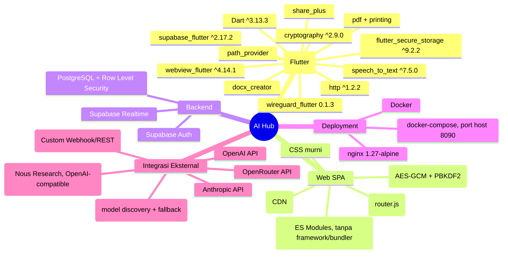

| Lapisan | Teknologi | Peran |
|---|---|---|
| Native shell | Flutter / Dart | Splash screen, WebView persisten, Bot BPJS (mic/STT), VPN tunnel, secure storage |
| Native — Supabase | `supabase_flutter` | Mirror sesi untuk `activity_log`, baca/tulis `bpjs_*` dari Bot BPJS |
| Native — WebView | `webview_flutter` | Merender SPA web di dalam shell, `NativeBridge` JS channel |
| Native — storage | `flutter_secure_storage` | Simpan config VPN lokal (Keystore/Keychain) |
| Native — VPN | `wireguard_flutter` (dengan patch `compileSdk` via `android/build.gradle.kts`, lihat §12) | Tunnel WireGuard sungguhan via Android `VpnService` |
| Native — STT | `speech_to_text` | Speech-to-text on-device untuk Bot BPJS |
| Native — kripto | `cryptography` | Dekripsi kredensial AES-GCM (mirror dari Web Crypto) |
| Native — PDF/DOCX | `pdf`+`printing` / `docx_creator` | Generate dokumen hasil Bot BPJS |
| Native — share | `share_plus` | Share sheet OS untuk file hasil ekspor |
| Web SPA | Vanilla JS ES Modules | Seluruh UI aplikasi, tanpa build step |
| Web — Supabase | `@supabase/supabase-js@2` (CDN) | Auth, query Postgres via REST, Realtime |
| Web — kripto | Web Crypto API | Enkripsi kredensial AI sebelum disimpan |
| Backend | Supabase | Auth, PostgreSQL, Row Level Security, Realtime |
| Web server | nginx `1.27-alpine` | Sajikan static files, `Cache-Control: no-store` untuk `.js/.html` |

**Catatan arsitektur penting**: `web/` di root project adalah SPA aktif yang disajikan nginx. `app/web/` (di dalam folder Flutter) adalah output build target Flutter-web bawaan, **tidak dipakai**.

---

## 2. Arsitektur Sistem

```mermaid
flowchart TD
    User["👤 Pengguna"]

    subgraph Native["📱 Flutter Native Shell"]
        Splash["SplashScreen"]
        Shell["WebShellScreen\n(WebViewController persisten)"]
        BotBpjs["BotBpjsScreen\n(100% native)"]
        Bridge["NativeBridge\n(postMessage JSON)"]
        SecureStorage["FlutterSecureStorage\n(VPN config)"]
        WireGuard["VpnTunnelService\n(wireguard_flutter → VpnService)"]
        STT["speech_to_text\n(on-device)"]
        NativeSupabase["Supabase Client (native)\n(mirror sesi)"]
    end

    subgraph DockerWeb["🐳 Docker: nginx (port 8090)"]
        SPA["SPA AI Hub\n(index.html + ES Modules)"]
    end

    subgraph Cloud["☁️ Supabase Cloud"]
        Auth["Auth (email/password)"]
        DB[("PostgreSQL\n+ Row Level Security\n7 tabel")]
        Realtime["Realtime\n(postgres_changes)"]
    end

    subgraph External["🌐 Provider/Agent AI Eksternal"]
        OpenAI["OpenAI API"]
        Anthropic["Anthropic API"]
        Gemini["Google Gemini API\n(+ model discovery)"]
        OpenRouter["OpenRouter API"]
        Hermes["Hermes (Nous Research)"]
        OpenClaw["OpenClaw Gateway\n(self-hosted, REST/Webhook)"]
    end

    User --> Splash --> Shell
    Shell -->|load URL, immersive sticky nav bar| SPA
    SPA <-->|Supabase JS SDK| Auth
    SPA <-->|Supabase JS SDK| DB
    SPA <-->|subscribe| Realtime
    SPA -->|fetch() langsung, tanpa server AI Hub| OpenAI
    SPA --> Anthropic
    SPA --> Gemini
    SPA --> OpenRouter
    SPA --> Hermes
    SPA --> OpenClaw

    SPA <-->|postMessage / __nativeReply| Bridge
    Bridge --> SecureStorage
    Bridge --> WireGuard
    Shell -->|tombol tab VPN/Bot| BotBpjs
    BotBpjs --> STT
    BotBpjs -->|dekripsi kredensial + panggil LLM langsung| External
    BotBpjs <-->|query/insert, RLS aktif| NativeSupabase
    NativeSupabase <--> DB

    style Native fill:#1e293b,color:#fff
    style DockerWeb fill:#0f4c3a,color:#fff
    style Cloud fill:#1a3a5c,color:#fff
    style External fill:#4a2c1a,color:#fff
```

**Poin kunci:**
- **Tidak ada server aplikasi AI Hub khusus** — container nginx hanya menyajikan file statis.
- Web SPA memanggil provider AI **langsung dari browser/WebView** — kunci API didekripsi sesaat sebelum dipakai.
- Flutter shell hanya menangani hal yang **wajib native**: mikrofon (Bot BPJS), tunnel VPN (WireGuard butuh `VpnService`), dan secure storage config VPN.
- `NativeBridge` adalah satu-satunya jalur komunikasi Web ↔ Flutter.
- `MainActivity`/`main.dart` memakai `SystemUiMode.immersiveSticky` (bukan sekadar edge-to-edge transparan) supaya navigation bar Android benar-benar tersembunyi, dengan `WidgetsBindingObserver` yang menerapkannya ulang setiap `AppLifecycleState.resumed` (Android cenderung memunculkan kembali nav bar setelah resume/keyboard ditutup).

---

## 3. Skema Database

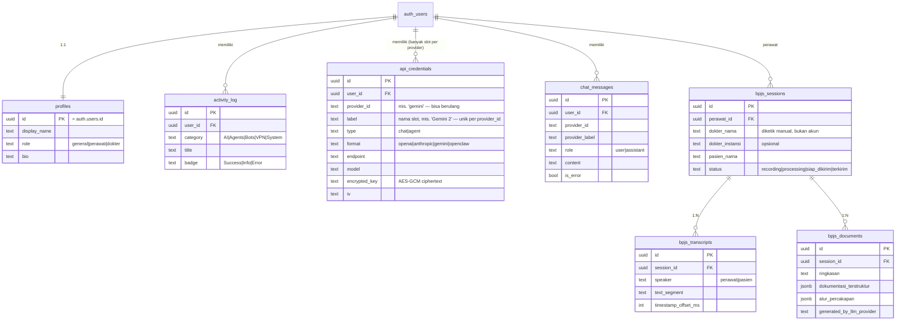

**7 tabel total**, semua dengan **Row Level Security aktif**. Tabel `friendships`, `messages`, `bpjs_reviews` sudah dihapus permanen (Friend System). Tabel terbaru: **`chat_messages`** (persist riwayat chat per provider, lihat §9).

**Constraint unik yang berubah**: `api_credentials` dulu `unique(user_id, provider_id)` — **sekarang `unique(user_id, provider_id, label)`**, supaya satu `provider_id` (mis. `gemini`) bisa punya beberapa baris/slot kunci sekaligus (lihat §7). Migrasi ini idempotent (`drop constraint if exists` lalu cek `pg_constraint` sebelum `add constraint`), aman dijalankan ulang di Supabase SQL Editor.

| Tabel | Aturan RLS kunci |
|---|---|
| `bpjs_sessions` / `bpjs_transcripts` / `bpjs_documents` | CRUD/insert/select hanya oleh `perawat_id` pemilik baris/sesi induk |
| `api_credentials` | CRUD penuh hanya oleh `user_id` pemilik baris |
| `chat_messages` | Select & insert & delete hanya oleh `user_id` pemilik — tidak ada policy update (pesan tidak diedit, hanya ditambah/dihapus sekaligus lewat `/clear`) |
| `activity_log` | Append-only: ada policy `insert`+`select`, **tidak ada** `update`/`delete` |

---

## 4. Alur Autentikasi & Startup

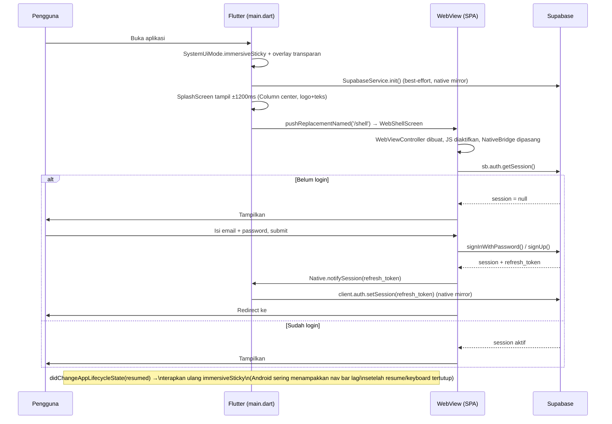

**Status: ✅ Fungsional.**

**Detail penting:**
- Guard router (`app.js`) mengecek sesi di setiap render.
- `onAuthStateChange` bisa fire lebih dari sekali saat startup — ditangani dengan `renderToken` di `router.js` (anti render dobel).
- `SplashScreen` sempat punya bug nyata: `Column` tanpa pembungkus `Center` hanya selebar kontennya sendiri lalu nempel ke kiri layar (dikonfirmasi lewat `adb screencap` langsung di device, bukan asumsi) — sudah diperbaiki dengan `Center` + `mainAxisSize: MainAxisSize.min`.

---

## 5. Alur Chat AI / Agent

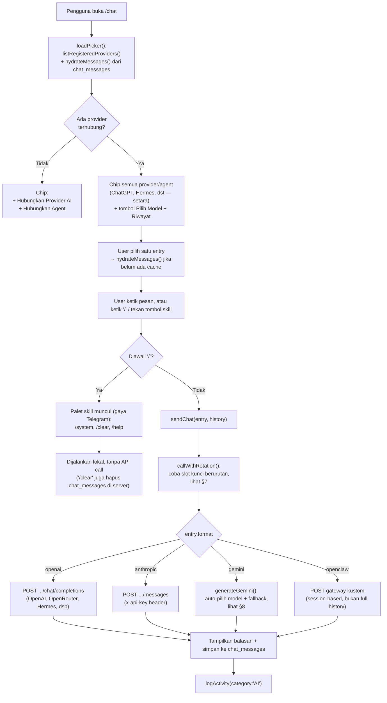

**Status: 🟡 Parsial** — kode lengkap dan adapter 4 format benar secara logic, tapi butuh API key asli milik pengguna untuk benar-benar memanggil provider (bring-your-own-key, bukan bug).

**Yang baru dibanding versi sebelumnya:**
- **Skills ala Telegram** — ketik `/` sebagai karakter pertama (atau tekan tombol `/` di sebelah kolom pesan) memunculkan palet perintah: `/system <instruksi>` (atur system prompt per-provider untuk sesi berjalan), `/clear` (bersihkan chat lokal **dan** di server), `/help`.
- **Riwayat chat persisten** — lihat §9.
- **Tombol "Pilih Model"** di topbar Chat (ikon lapis) mengarah ke `/settings/apikeys`; tombol riwayat (ikon jam) mengarah ke `/history`.

---

## 6. Alur Universal API Key (Deteksi Otomatis + Provider vs Agent)

```mermaid
flowchart TD
    EntryPoint["User tekan '+ Provider AI'\natau '+ Agent'\n(di Chat atau halaman Provider & Agent)"] --> Mode{"URL query\n?type=provider / ?type=agent"}
    Mode -->|provider| FilterChat["Tampilkan hanya katalog type:'chat'\n(ChatGPT, Claude, Gemini, OpenRouter)"]
    Mode -->|agent| FilterAgent["Tampilkan hanya katalog type:'agent'\n(Hermes) + Self-hosted (OpenClaw)"]
    FilterChat --> Paste["User tempel API key\ndi satu kolom"]
    FilterAgent --> Paste
    FilterAgent --> SelfHosted["Atau isi URL Gateway + Bearer token\n(OpenClaw — bukan API key vendor)"]
    Paste --> Detect["detectProvider(rawKey)"]
    Detect --> Match{Cocok regex\nKNOWN_PROVIDERS?}
    Match -->|sk-... (bukan ant-/or-v1-/nous-)| OpenAI["ChatGPT (OpenAI)"]
    Match -->|sk-ant-...| Claude["Claude (Anthropic)"]
    Match -->|AIzaSy... / AQ....| GeminiD["Gemini (Google)\n— 2 format key didukung"]
    Match -->|sk-or-v1-...| OR["OpenRouter"]
    Match -->|sk-nous-...| HermesD["Hermes (Nous Research)"]
    Match -->|Tidak cocok apa pun| Manual["Quick-pick dari katalog (sesuai mode)\n+ opsi 'API/agent lain' (form manual)"]
    OpenAI --> ExistingCheck
    Claude --> ExistingCheck
    GeminiD --> ExistingCheck
    OR --> ExistingCheck
    HermesD --> ExistingCheck
    Manual --> FillForm["User isi: nama, jenis, endpoint, model"]
    FillForm --> ExistingCheck
    SelfHosted --> ExistingCheckSH["saveProvider() langsung\n(format: openclaw)"]
    ExistingCheck{"countCredentialSlots(provider_id) > 0?\n(sudah ada key provider ini?)"}
    ExistingCheck -->|Tidak, slot pertama| Save
    ExistingCheck -->|Ya| AskSlotName["Minta nama slot baru\n(disarankan: 'Gemini 2', dst)"]
    AskSlotName --> Save
    Save["saveCredential(entry, apiKey)"] --> Encrypt["PBKDF2-SHA256 (100k iterasi)\n→ turunkan AES-256-GCM key\ndari UID + pepper"]
    Encrypt --> EncryptValue["AES-GCM encrypt(apiKey)"]
    EncryptValue --> Upsert["UPSERT api_credentials\nonConflict: user_id,provider_id,label"]
    Upsert --> Done["Entry muncul di Chat sebagai 1 chip\n(walau provider punya >1 slot — lihat §7)"]
```

**Status: ✅ Fungsional.**

**Perubahan penting dibanding versi sebelumnya:**
- **Pemisahan Provider AI vs Agent saat setup** — sebelumnya satu form campur, sekarang `/settings/add-api-key?type=provider` dan `?type=agent` adalah dua pintu masuk berbeda (judul, deskripsi, katalog yang ditampilkan semua ikut berbeda), supaya pengguna tidak bingung antara "AI biasa" dan "agent". Setelah tersambung, keduanya tetap setara dan tampil bersisian di Chat (keputusan desain lama tetap dipertahankan).
- **Hermes** kini punya entri katalog asli (bukan simulasi) — endpoint Nous Research Portal (`inference-api.nousresearch.com`, OpenAI-compatible, key `sk-nous-...`).
- **OpenClaw** punya jalur tersendiri di luar `KNOWN_PROVIDERS` (`SELF_HOSTED_PROVIDERS`) karena bukan API key vendor tetap — field-nya adalah URL Gateway + Bearer token milik instance self-hosted pengguna sendiri, memakai *Custom Webhook/Gateway REST API* OpenClaw supaya balasan agent masuk ke Chat aplikasi ini (bukan Telegram/WhatsApp seperti biasanya).
- **Bug regex OpenAI** (menangkap key provider lain karena semua diawali `sk-`) sudah diperbaiki dengan negative lookahead `(?!ant-|or-v1-|nous-)`.
- **Simpan key kedua untuk provider yang sama** sekarang tidak lagi diam-diam menimpa key lama — lihat §7.

**Keamanan kunci**: AES-GCM key diturunkan dari `UID + pepper` via PBKDF2, bukan secret independen seperti Keystore asli perangkat. **Row Level Security tetap kontrol akses sesungguhnya.**

---

## 7. Multi-Key per Provider (Slot & Auto-Rotation)

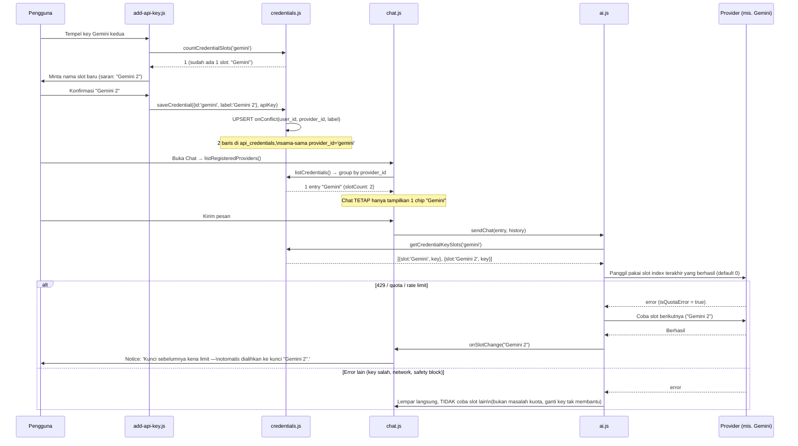

**Status: ✅ Fungsional (baru).**

**Kenapa ini ada**: sebelumnya menyimpan key kedua untuk provider yang sama (mis. 2 akun Gemini gratis untuk menghindari limit) akan **menimpa diam-diam** key pertama (constraint lama `unique(user_id, provider_id)`). Sekarang:
- Constraint jadi `unique(user_id, provider_id, label)` — banyak slot per provider diperbolehkan.
- `credentials.js` punya dua lapisan: `listCredentialSlots()` (mentah, per baris — dipakai halaman Provider & Agent untuk kelola slot satu-satu) dan `listCredentials()` (dikelompokkan per `provider_id` — dipakai Chat supaya tetap 1 chip per provider).
- `ai.js`'s `callWithRotation()` mengingat slot index terakhir yang berhasil (`lastGoodSlot`, hanya di memori halaman, reset saat reload) dan hanya pindah slot kalau errornya **spesifik soal kuota/rate-limit** (`status 429` atau pesan mengandung "quota"/"rate limit"/"resource_exhausted") — error lain (key salah, jaringan putus, konten diblokir) langsung dilempar ke pengguna tanpa membuang percobaan ke semua slot.
- Halaman **Provider & Agent** (`apikeys.js`) menampilkan badge jumlah slot (mis. "Provider chat · 2 kunci") dan daftar slot individual di dalam card yang sama (bukan blok terpisah tanpa gaya) — tiap slot bisa dihapus sendiri-sendiri tanpa memutus seluruh provider.

---

## 8. Gemini: Pemilihan Model & Fallback Otomatis

```mermaid
flowchart TD
    Send["sendChat() format:'gemini'"] --> HasPreferred{entry.model\nsudah diset & bukan 'auto'?}
    HasPreferred -->|Ya| TryPreferred["Coba model pilihan pengguna"]
    HasPreferred -->|Tidak| Discover["listGeminiModels():\nGET .../models, rank by\nflash/pro, preview di-deprioritaskan"]
    TryPreferred --> Result{Hasil?}
    Discover --> TryTop5["Coba sampai 5 kandidat teratas\nyang belum dicoba"]
    TryTop5 --> Result
    Result -->|Sukses| Done["Balas + updateCredentialModel()\nkalau model berubah dari semula"]
    Result -->|modelUnavailable| NextCandidate["Coba kandidat berikutnya"]
    NextCandidate --> TryTop5
    Result -->|Error lain (auth/safety/network)| Stop["Hentikan — bukan masalah\nketersediaan model"]

    subgraph ErrorClassification["Klasifikasi error (gemini.js)"]
        E400["400/404 + pesan 'model...not found/deprecated'"] --> MU["modelUnavailable = true"]
        E429Zero["429 + pesan mengandung 'limit: 0'\n(model memang tak dapat kuota gratis\nsama sekali, bukan kuota habis)"] --> MU
        E503["503 'high demand'"] -->|retry 2x (700ms, 1800ms)\nmasih gagal| MU
        E429Normal["429 kuota habis terpakai (limit > 0)"] --> QuotaErr["Error biasa →\npicu rotasi SLOT (§7), bukan ganti model"]
    end
```

**Status: ✅ Fungsional (baru, hasil debugging sesi nyata).**

**Tiga bug nyata yang ditemukan & diperbaiki saat pengujian:**
1. **`limit: 0` disalahartikan sebagai kuota habis** — padahal artinya model itu (mis. model preview/eksperimental tertentu) memang tidak mendapat kuota gratis sama sekali untuk siapa pun, permanen. Mengganti API key tidak membantu. Sekarang error ini diklasifikasikan sebagai `modelUnavailable`, memicu percobaan **model lain**, bukan rotasi key.
2. **503 "sedang sibuk" langsung menyerah** — sekarang di-retry otomatis 2× dengan jeda singkat (700ms, 1800ms) sebelum dianggap `modelUnavailable` dan beralih ke model lain.
3. **Jumlah kandidat fallback dinaikkan** dari 3 ke 5 model, karena 503 kini juga "memakai jatah" percobaan.

Pengguna juga bisa memilih model manual lewat tombol **"Pilih Model"** (`model-picker.js`) — menampilkan daftar model Gemini yang tersedia (hasil `listGeminiModels()`) atau mengetik ID model sendiri untuk provider non-Gemini.

---

## 9. Riwayat Chat (Chat History)

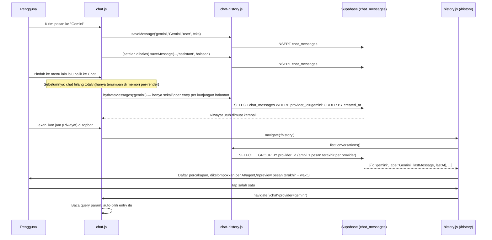

**Status: ✅ Fungsional (baru).**

**Masalah yang diperbaiki**: sebelumnya chat disimpan **hanya di memori JS halaman** (`Map` lokal di dalam `chat.js`'s `render()`) — begitu pengguna pindah ke menu lain, router membuang instance halaman itu, dan percakapan hilang total. Sekarang setiap pesan (user & balasan AI, bukan output lokal skill seperti `/help`) disimpan ke tabel `chat_messages` lewat `chat-history.js`, dan dimuat ulang dari server saat Chat dibuka lagi.

**Halaman Riwayat** (`/history`, tombol ikon jam di topbar Chat — tepat di sebelah tombol yang mengarah ke "Provider & Agent" sesuai desain yang diminta) mengelompokkan riwayat per AI/agent, menampilkan preview pesan terakhir, lalu membuka Chat dengan AI/agent itu langsung aktif saat ditekan.

`/clear` di Chat menghapus baik cache lokal **maupun** baris di `chat_messages` (`clearConversation()`), bukan cuma tampilan.

---

## 10. Alur Bot BPJS — End to End

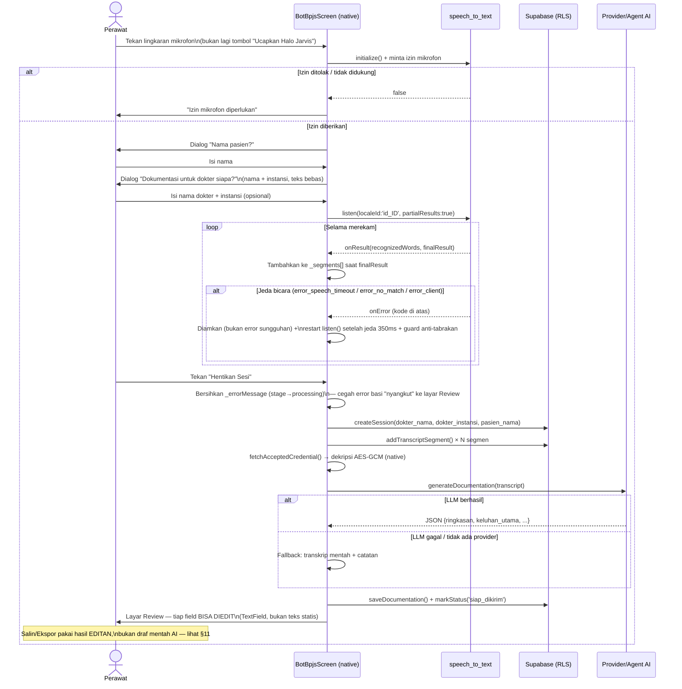

**Status: ✅ Fungsional — dirombak ulang untuk menghapus branding "Halo Jarvis" dan menambah review yang bisa diedit.**

| Bagian | Status | Keterangan |
|---|---|---|
| Nyalakan sesi | ✅ Fungsional | **Tekan lingkaran mikrofon langsung** — tombol "Ucapkan Halo Jarvis" terpisah sudah dihapus, tidak ada lagi klaim wake-word |
| Rekam suara → teks (STT) | ✅ Fungsional | `speech_to_text` on-device, auto-restart saat jeda, error transien (`error_speech_timeout`/`error_no_match`/`error_client`) disaring agar tidak tampil sebagai error merah |
| Target dokter | ✅ Fungsional | Nama + instansi diketik manual, tidak butuh akun dokter |
| Generate dokumentasi via LLM | ✅ Fungsional (jika ada API key) | Fallback transkrip mentah jika tak ada provider |
| **Review bisa diedit** | ✅ Fungsional (baru) | Tiap field (`ringkasan`, `catatan`, dst.) jadi `TextField` — perawat membenarkan tulisan sebelum disalin/diekspor, bukan sekadar baca draf AI mentah |
| Salin teks / ekspor PDF & DOCX | ✅ Fungsional | Memakai hasil **editan** perawat (`_editedDraft`), bukan draf asli dari AI — lihat §11 |
| ~~Wake word "Halo Jarvis"~~ | — | **Dihapus total** atas permintaan eksplisit pengguna — bot ini sekarang murni tekan-mic, bukan asisten bernama |
| Speaker diarization | 🔴 Belum ada | Semua segmen ditandai `speaker: 'perawat'` — butuh model diarization terpisah |

---

## 11. Alur Export & Bagikan Dokumentasi

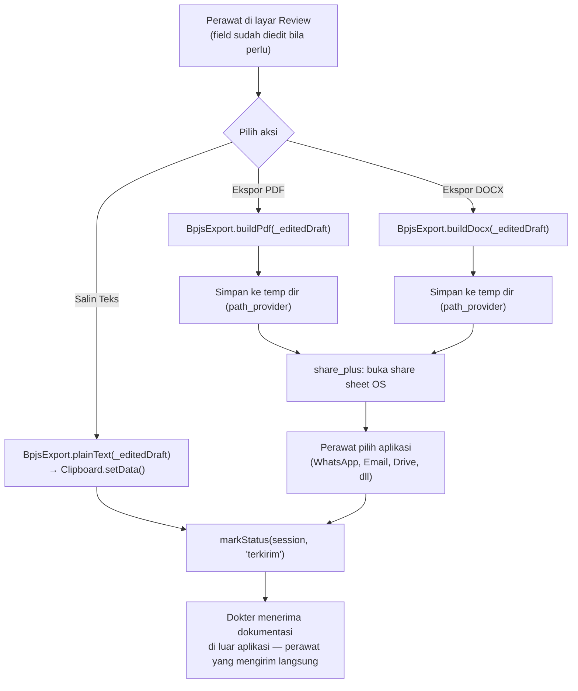

**Status: ✅ Fungsional** — ketiganya kini memakai `_editedDraft` (getter yang membaca langsung dari `TextEditingController` layar Review), sehingga apa yang disalin/diekspor **selalu** sama persis dengan yang terakhir diketik perawat di layar — bukan draf asli AI yang belum tentu benar.

---

## 12. Alur VPN

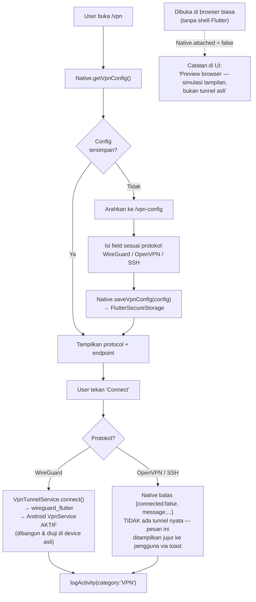

**Status: 🟡 Parsial** — WireGuard **sungguhan** (tunnel nyata via `VpnService`, APK sudah berhasil dibuild & diinstall ke device fisik), OpenVPN/SSH masih **config-only**.

**Catatan build WireGuard**: plugin `wireguard_flutter 0.1.3` meng-hardcode `compileSdkVersion 31` di `android/build.gradle` miliknya sendiri, padahal dependency transitifnya (AndroidX) butuh compile SDK 33+ — menyebabkan build gagal berulang kali. Diperbaiki dengan override langsung di `app/android/build.gradle.kts`: `project(":wireguard_flutter").afterEvaluate { ...compileSdk = 35... }` (harus pakai `afterEvaluate` yang di-scope ke modul itu saja, bukan `subprojects` umum, karena `:app` sudah dipaksa evaluasi lebih dulu oleh `evaluationDependsOn(":app")` yang sudah ada).

**Catatan UX**: halaman VPN sekarang jujur membedakan tiga kondisi — WireGuard dengan tunnel asli aktif, protokol lain yang baru config-only, dan mode preview-browser (tanpa shell native sama sekali) — supaya pengguna tidak salah kira semuanya sudah jalan sungguhan.

---

## 13. Alur Activity Log

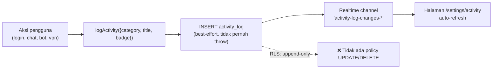

**Status: ✅ Fungsional.** Kategori: `AI`, `Agents`, `Bots`, `VPN`, `System`.

---

## 14. Native Bridge (Web ⇄ Flutter)

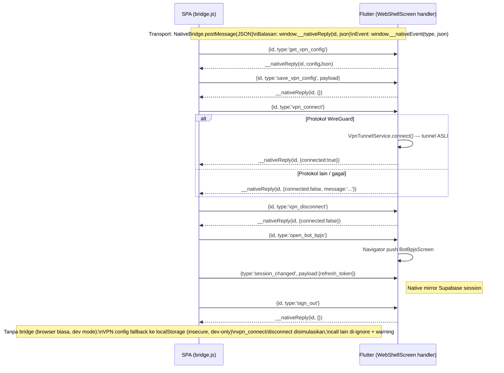

**Timeout**: setiap panggilan native punya batas 8 detik (`CALL_TIMEOUT_MS`) — jika native tidak membalas, Promise resolve `null`.

**7 tipe pesan** ditangani native: `session_changed`, `get_vpn_config`, `save_vpn_config`, `vpn_connect`, `vpn_disconnect`, `open_bot_bpjs`, `sign_out`. Kredensial API AI/agent **tidak lagi lewat bridge ini sama sekali** — sejak dipindah ke penyimpanan Supabase terenkripsi langsung dari web (`credentials.js`), supaya key tidak hilang saat uninstall/ganti device.

---

## 15. Deployment

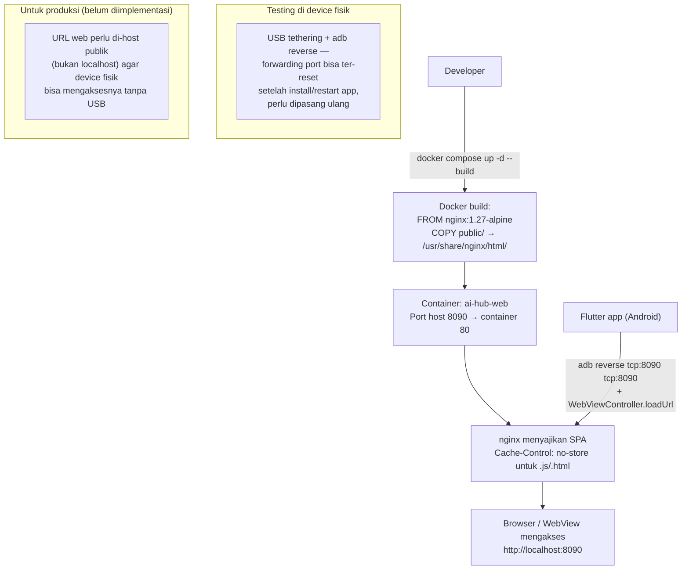

**Konfigurasi kunci `nginx.conf`:**
- `Access-Control-Allow-Origin: *` — supaya SPA bisa dibuka langsung dari browser biasa saat development.
- `Cache-Control: no-store, must-revalidate` khusus `.js`/`.html` — supaya rebuild langsung terlihat efeknya.

**Build native**: `flutter build apk --debug` dipakai untuk iterasi cepat (tapi lambat — cold start pertama bisa ~4 detik di device kelas menengah karena JIT/Dart VM debug) dan `flutter build apk --release` untuk pengujian performa sungguhan.

---

## 16. Ringkasan Status Fitur

| Fitur | Status | Catatan |
|---|---|---|
| Login / Registrasi | ✅ Fungsional | |
| Profil (nama, role, bio) | ✅ Fungsional | |
| Pertemanan (Friend System) | — | Dihapus total — lihat §10 |
| Chat dengan provider/agent AI | 🟡 Parsial | Logic benar, butuh API key asli pengguna |
| Skills chat (`/system`, `/clear`, `/help`) | ✅ Fungsional | Gaya Telegram, palet muncul saat ketik `/` |
| Riwayat chat persisten + halaman Riwayat | ✅ Fungsional | Lihat §9 |
| Universal API key (deteksi otomatis) | ✅ Fungsional | Pemisahan Provider vs Agent saat setup |
| Hermes (agent, API asli) | ✅ Fungsional | Nous Research Portal, OpenAI-compatible |
| OpenClaw (agent self-hosted) | ✅ Fungsional | Via Gateway REST/Custom Webhook milik pengguna |
| Multi-key per provider + auto-rotation saat limit | ✅ Fungsional | Lihat §7 |
| Gemini auto-fallback model (404/429 limit:0/503) | ✅ Fungsional | Lihat §8 |
| Kredensial terenkripsi (AES-GCM) | ✅ Fungsional | |
| Bot Hub (katalog) | ✅ Fungsional | |
| Bot BPJS — rekam suara (STT) | ✅ Fungsional | Error transien disaring, auto-restart |
| Bot BPJS — mulai sesi | ✅ Fungsional | Tekan mic langsung, "Halo Jarvis" dihapus |
| Bot BPJS — review bisa diedit | ✅ Fungsional (baru) | `TextField` per section, bukan teks statis |
| Bot BPJS — salin teks / ekspor PDF & DOCX | ✅ Fungsional | Pakai hasil editan, bukan draf AI mentah |
| Bot BPJS — wake word pasif | — | Dihapus total, tidak pernah diklaim lagi |
| Bot BPJS — speaker diarization | 🔴 Belum ada | Butuh model terpisah |
| VPN WireGuard (tunnel asli) | ✅ Fungsional | Build berhasil, diuji di device fisik |
| VPN OpenVPN/SSH | 🟡 Parsial | Config tersimpan, tunnel belum nyata |
| Immersive nav bar (Android) | ✅ Fungsional | `immersiveSticky` + reapply saat resume |
| Splash screen center | ✅ Fungsional (bug nyata, sudah diperbaiki) | Dikonfirmasi via screenshot device langsung |
| Activity Log | ✅ Fungsional | |

### Riwayat Perbaikan Penting (sesi terbaru)

| Area | Temuan | Perbaikan |
|---|---|---|
| Gemini key detection | Format key baru `AQ.Ab8R...` dari aistudio.google.com belum dikenali | Regex diperluas: `AIzaSy...` ATAU `AQ....` |
| Chat setup | Provider & Agent tercampur dalam satu form, membingungkan | Dipisah jadi dua mode (`?type=provider`/`?type=agent`) |
| Agent nyata | Hermes/OpenClaw awalnya cuma konsep, belum diverifikasi API-nya | Diriset: Hermes punya endpoint resmi (Nous Portal); OpenClaw punya Gateway REST/Webhook — keduanya diimplementasikan sungguhan |
| VPN | Tidak ada tunnel asli sama sekali | WireGuard diimplementasikan via `wireguard_flutter` + fix `compileSdk` plugin yang gagal build berkali-kali |
| Multi API key | Key kedua untuk provider sama menimpa diam-diam key pertama | Constraint DB diubah jadi per-slot + UI penamaan slot + auto-rotation saat limit |
| Gemini reliability | Model `limit:0` dan `503` dianggap error fatal, chat macet terus | Diklasifikasikan ulang sebagai `modelUnavailable` → otomatis coba model lain |
| Chat persistence | Pindah menu = riwayat chat hilang total | Tabel `chat_messages` + hydrasi otomatis + halaman `/history` |
| Bot BPJS UX | Branding "Halo Jarvis" tidak sesuai kebutuhan nyata (perawat cuma mau tekan-mic) | Tombol wake-word dihapus, lingkaran mic langsung bisa ditekan, review jadi bisa diedit |
| Bot BPJS STT | `error_speech_timeout`/`error_client` tampil sebagai error merah padahal cuma jeda bicara normal | Disaring dari tampilan, recognizer di-restart dengan jeda+guard anti race |
| Native UI | Navigation bar Android tidak hilang, mengganggu | `SystemUiMode.immersiveSticky` + reapply di lifecycle resume |
| Native UI | Splash screen logo/teks mepet ke kiri | `Center` yang hilang saat refactor dikembalikan, dikonfirmasi via screenshot device |

---

*Dokumen ini mencerminkan kondisi **working tree** (termasuk perubahan belum di-commit) per 5 Oktober 2026. Untuk status paling akurat, baca langsung kode di `app/lib/` dan `web/public/` — dokumen bisa menjadi usang seiring pengembangan lanjutan.*
