# Diagram Alur — AI Hub (PROJECT MOBILE APP)

> Dokumen ini dibuat dengan membaca kode sumber langsung (bukan asumsi) per **1 Oktober 2026**, commit `28fd897`. Semua diagram pakai [Mermaid](https://mermaid.js.org/) — buka file ini di Obsidian, GitHub, atau editor Markdown apa pun yang mendukung Mermaid untuk melihat visualnya.
>
> Status tiap alur ditandai: ✅ **Fungsional** (diverifikasi dengan data sungguhan, bukan cuma baca kode) · 🟡 **Parsial** (jalan tapi ada batasan) · 🔴 **Simulasi/belum ada**.

## Daftar Isi

1. [Tech Stack](#1-tech-stack)
2. [Arsitektur Sistem](#2-arsitektur-sistem)
3. [Skema Database](#3-skema-database)
4. [Alur Autentikasi & Startup](#4-alur-autentikasi--startup)
5. [Alur Pertemanan (Friends)](#5-alur-pertemanan-friends)
6. [Alur Chat AI / Agent](#6-alur-chat-ai--agent)
7. [Alur Universal API Key (Deteksi Otomatis)](#7-alur-universal-api-key-deteksi-otomatis)
8. [Alur Bot BPJS — End to End](#8-alur-bot-bpjs--end-to-end)
9. [Alur VPN](#9-alur-vpn)
10. [Alur Activity Log](#10-alur-activity-log)
11. [Native Bridge (Web ⇄ Flutter)](#11-native-bridge-web--flutter)
12. [Deployment](#12-deployment)
13. [Ringkasan Status Fitur](#13-ringkasan-status-fitur)

---

## 1. Tech Stack

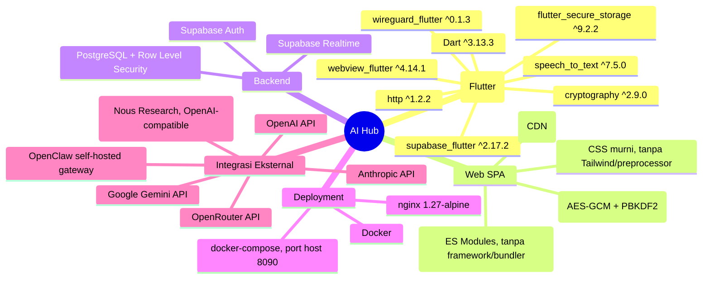

| Lapisan | Teknologi | Versi | Peran |
|---|---|---|---|
| Native shell | Flutter / Dart | SDK `^3.13.3` | Splash screen, WebView persisten, navigasi bawah, Bot BPJS (mic/STT), VPN tunnel, secure storage |
| Native — Supabase | `supabase_flutter` | `^2.17.2` | Mirror sesi untuk `activity_log`, query `friendships`/`profiles`/`bpjs_*` dari Bot BPJS |
| Native — WebView | `webview_flutter` | `^4.14.1` | Merender SPA web di dalam shell |
| Native — storage | `flutter_secure_storage` | `^9.2.2` | Simpan config VPN lokal (Keystore/Keychain) |
| Native — VPN | `wireguard_flutter` | `^0.1.3` | Tunnel WireGuard sungguhan via Android `VpnService` |
| Native — STT | `speech_to_text` | `^7.5.0` | Speech-to-text on-device untuk Bot BPJS |
| Native — kripto | `cryptography` | `^2.9.0` | Dekripsi kredensial AES-GCM (mirror dari Web Crypto) |
| Web SPA | Vanilla JS ES Modules | — | Seluruh UI aplikasi (11+ halaman), tanpa build step |
| Web — Supabase | `@supabase/supabase-js@2` | CDN | Auth, query Postgres via REST, Realtime subscription |
| Web — kripto | Web Crypto API (`crypto.subtle`) | native browser | Enkripsi kredensial AI sebelum disimpan ke Supabase |
| Backend | Supabase | — | Auth, PostgreSQL, Row Level Security, Realtime |
| Web server | nginx | `1.27-alpine` | Sajikan static files SPA, `Cache-Control: no-store` untuk `.js/.html` |
| Container | Docker Compose | — | 1 service `web`, port host `8090` → container `80` |

**Catatan arsitektur penting**: `web/` di root project adalah SPA aktif yang disajikan nginx. `app/web/` (di dalam folder Flutter) adalah output build target Flutter-web bawaan, **tidak dipakai** — container nginx tidak menyalin folder itu.

---

## 2. Arsitektur Sistem

```mermaid
flowchart TD
    User["👤 Pengguna\n(Perawat / Dokter / Umum)"]

    subgraph Native["📱 Flutter Native Shell"]
        Splash["SplashScreen"]
        Shell["WebShellScreen\n(WebViewController persisten)"]
        BotBpjs["BotBpjsScreen\n(100% native)"]
        Bridge["NativeBridge\n(postMessage JSON)"]
        SecureStorage["FlutterSecureStorage\n(VPN config)"]
        WireGuard["WireGuard Plugin\n(VpnService Android)"]
        STT["speech_to_text\n(on-device)"]
        NativeSupabase["Supabase Client (native)\n(mirror sesi)"]
    end

    subgraph DockerWeb["🐳 Docker: nginx (port 8090)"]
        SPA["SPA AI Hub\n(index.html + ES Modules)"]
    end

    subgraph Cloud["☁️ Supabase Cloud"]
        Auth["Auth\n(email/password)"]
        DB[("PostgreSQL\n+ Row Level Security")]
        Realtime["Realtime\n(postgres_changes)"]
    end

    subgraph External["🌐 Provider/Agent AI Eksternal"]
        OpenAI["OpenAI API"]
        Anthropic["Anthropic API"]
        Gemini["Google Gemini API"]
        OpenRouter["OpenRouter API"]
        Hermes["Hermes (Nous Research)"]
        OpenClaw["OpenClaw Gateway\n(self-hosted)"]
    end

    User --> Splash --> Shell
    Shell -->|load URL| SPA
    SPA <-->|Supabase JS SDK| Auth
    SPA <-->|Supabase JS SDK| DB
    SPA <-->|subscribe| Realtime
    SPA -->|fetch() langsung, tanpa server AI Hub| OpenAI
    SPA --> Anthropic
    SPA --> Gemini
    SPA --> OpenRouter
    SPA --> Hermes
    SPA --> OpenClaw

    SPA <-->|postMessage / __nativeReply| Bridge
    Bridge --> SecureStorage
    Bridge --> WireGuard
    Shell -->|tombol tab VPN/Bot| BotBpjs
    BotBpjs --> STT
    BotBpjs -->|dekripsi kredensial + panggil LLM langsung| External
    BotBpjs <-->|query/insert, RLS aktif| NativeSupabase
    NativeSupabase <--> DB

    style Native fill:#1e293b,color:#fff
    style DockerWeb fill:#0f4c3a,color:#fff
    style Cloud fill:#1a3a5c,color:#fff
    style External fill:#4a2c1a,color:#fff
```

**Poin kunci:**
- **Tidak ada server aplikasi AI Hub khusus.** Container nginx hanya menyajikan file statis (HTML/CSS/JS) — bukan proxy API, bukan worker pemrosesan.
- Web SPA memanggil provider AI **langsung dari browser/WebView** (`fetch()` ke `api.openai.com`, dst.) — kunci API didekripsi sesaat sebelum dipakai, tidak pernah lewat server perantara.
- Flutter shell hanya menangani hal yang **wajib native**: mikrofon (Bot BPJS), tunnel VPN (WireGuard butuh `VpnService` Android), dan secure storage config VPN.
- `NativeBridge` adalah **satu-satunya** jalur komunikasi Web ↔ Flutter — transport `postMessage` (Web→Native) dan `window.__nativeReply`/`__nativeEvent` (Native→Web).

---

## 3. Skema Database

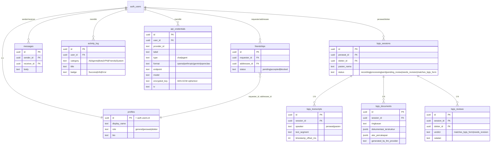

**9 tabel total**, semua dengan **Row Level Security aktif**. Aturan RLS yang paling penting (bukan sekadar "user hanya lihat miliknya"):

| Tabel | Aturan RLS kunci |
|---|---|
| `bpjs_sessions` | **Insert hanya boleh jika** perawat dan dokter target punya `friendships.status = 'accepted'` — dicek di level database, bukan cuma UI |
| `bpjs_reviews` | Insert hanya boleh oleh `dokter_id` yang **memang jadi target** sesi tersebut (`bpjs_sessions.dokter_id = auth.uid()`) |
| `bpjs_transcripts` / `bpjs_documents` | Insert hanya oleh `perawat_id` pemilik sesi; select oleh perawat **atau** dokter sesi itu |
| `api_credentials` | CRUD penuh hanya oleh `user_id` pemilik baris — tidak ada akses lintas user sama sekali |
| `activity_log` | Append-only: ada policy `insert`+`select`, **tidak ada** policy `update`/`delete` |

---

## 4. Alur Autentikasi & Startup

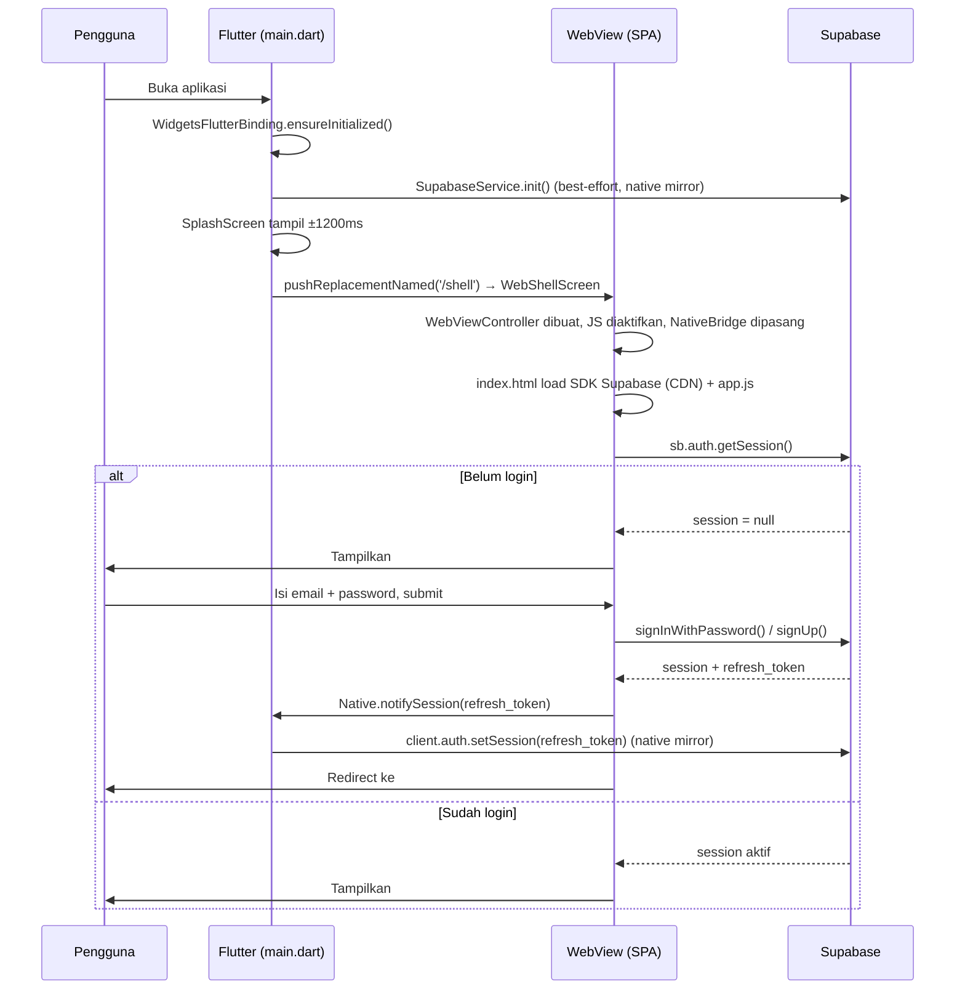

**Status: ✅ Fungsional** — diverifikasi dengan signup, login, dan persistensi sesi nyata via REST API.

**Detail penting:**
- Guard router (`app.js`) mengecek sesi di **setiap render**: belum login + bukan `/login` → redirect ke `/login`; sudah login + buka `/login` → redirect ke `/home`.
- `onAuthStateChange` bisa fire lebih dari sekali saat startup (`INITIAL_SESSION` lalu event lain) — pernah menyebabkan **bug render dobel** (lihat §13), sudah diperbaiki dengan `renderToken` di `router.js`.
- Validasi lokal: email harus mengandung `@`, password minimal 6 karakter — keputusan auth sesungguhnya tetap dari Supabase.

---

## 5. Alur Pertemanan (Friends)

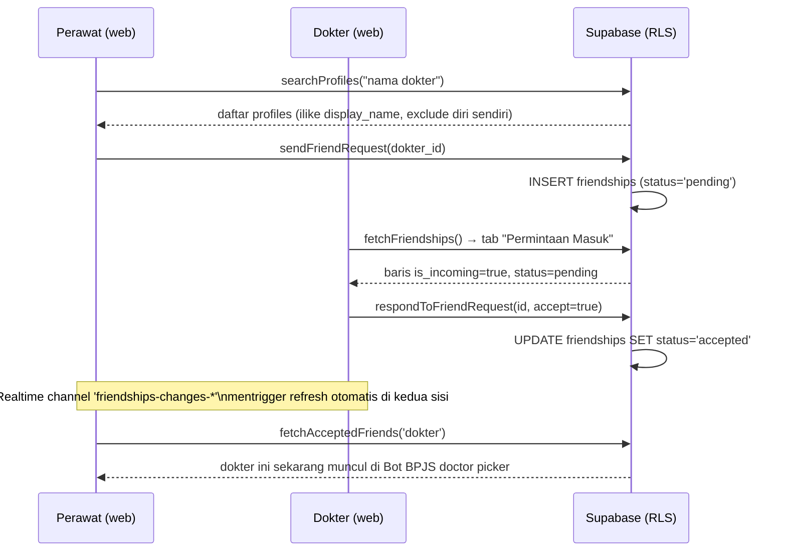

**Status: ✅ Fungsional** — diuji end-to-end: cari profil → kirim request → terima → `fetchAcceptedDoctors()` mengembalikan hasil benar.

**Catatan historis**: fitur ini **sempat hilang total** (tidak ada route `/friends`, tidak ada fungsi database) setelah refactor registry provider AI pada 25–29 September — ditemukan lewat audit dan dibangun ulang pada 1 Oktober (lihat §13).

---

## 6. Alur Chat AI / Agent

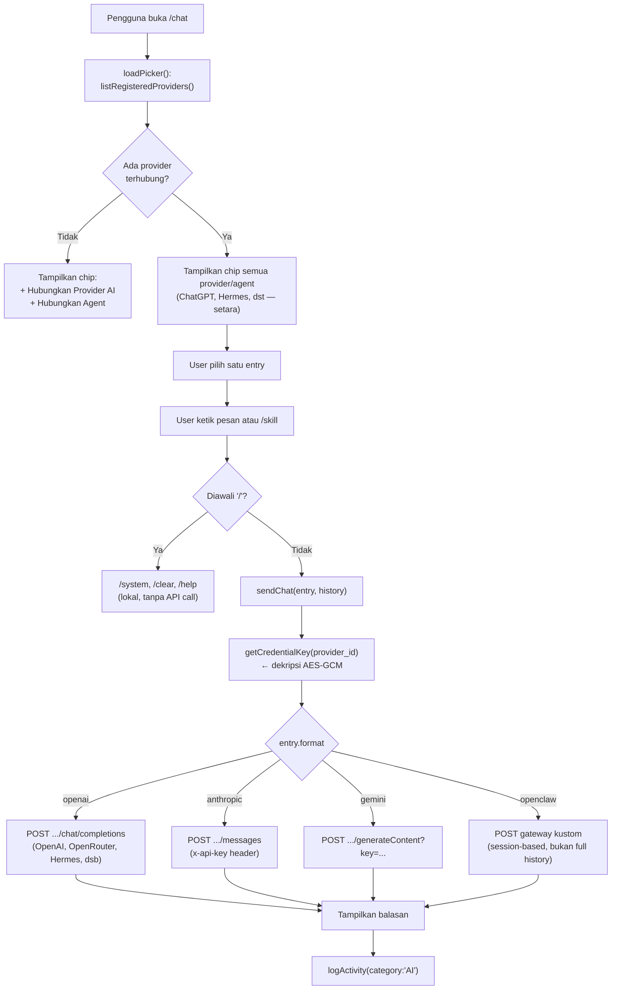

**Status: 🟡 Parsial** — kode lengkap dan adapter 4 format terverifikasi benar secara logic, tapi **butuh API key asli milik pengguna** untuk benar-benar memanggil provider (bring-your-own-key, bukan bug).

---

## 7. Alur Universal API Key (Deteksi Otomatis)

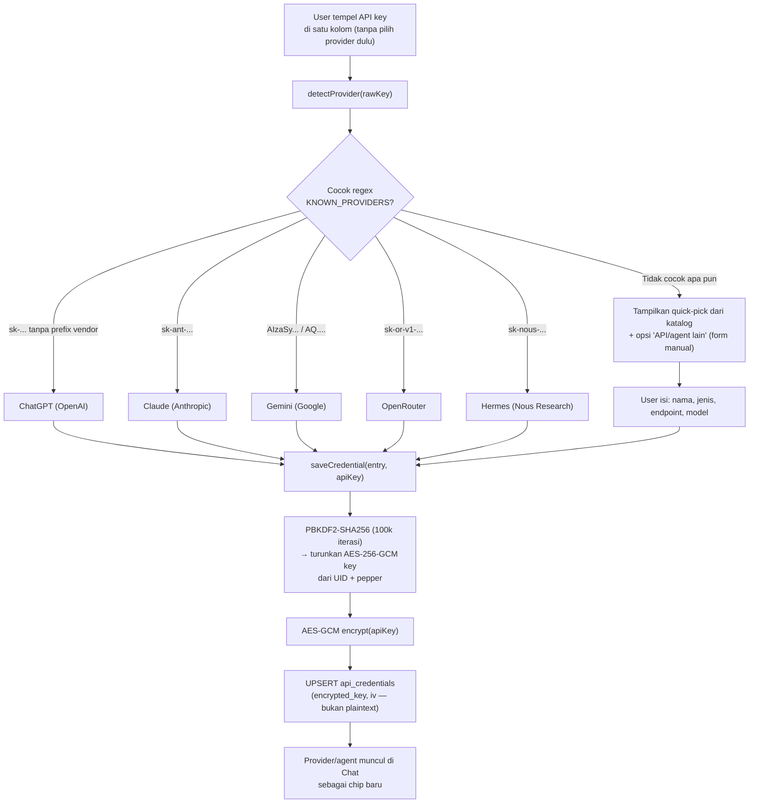

**Status: ✅ Fungsional** — diverifikasi dengan test regex (6/6 pola lolos setelah bug diperbaiki) dan round-trip enkripsi sungguhan (encrypt → simpan → baca → dekripsi → plaintext identik).

**Bug yang ditemukan & diperbaiki (1 Okt 2026)**: pola regex OpenAI awalnya `/^sk-(proj-)?[A-Za-z0-9_-]{20,}$/` — terlalu rakus, ikut menangkap `sk-ant-...`, `sk-or-v1-...`, `sk-nous-...` karena semua diawali `sk-`. Diperbaiki dengan negative lookahead `(?!ant-|or-v1-|nous-)`.

**Keamanan kunci**: AES-GCM key diturunkan dari `UID + pepper` via PBKDF2, bukan secret independen seperti Keystore asli perangkat. **Row Level Security tetap kontrol akses sesungguhnya** — enkripsi ini defense-in-depth kalau tabel pernah ter-expose lewat jalur lain (dashboard screen-share, CSV export, dsb).

---

## 8. Alur Bot BPJS — End to End

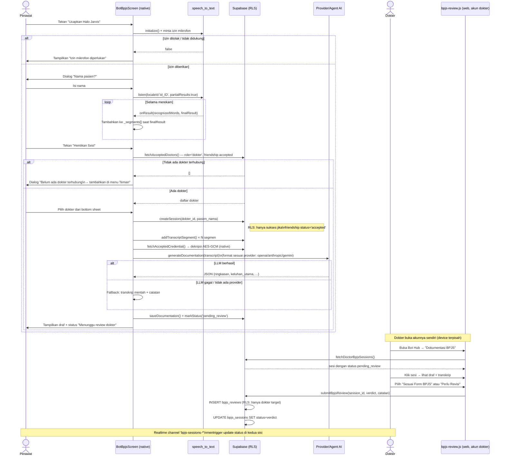

**Status: 🟡 Parsial (ditingkatkan signifikan 1 Okt 2026)** — diverifikasi end-to-end dengan data sungguhan via REST API (buat sesi → transcript → dokumentasi → kirim → dokter review → status berubah, plus RLS menolak dokter yang bukan target).

| Bagian | Status | Keterangan |
|---|---|---|
| Rekam suara → teks (STT) | ✅ Fungsional | `speech_to_text` on-device, `localeId: 'id_ID'`, auto-restart saat jeda |
| Validasi dokter via friendship | ✅ Fungsional | Query `fetchAcceptedDoctors()` asli, bukan lagi hardcoded 3 nama |
| Simpan sesi/transkrip/dokumen | ✅ Fungsional | RLS diverifikasi menolak insert tanpa friendship accepted |
| Generate dokumentasi via LLM | ✅ Fungsional (jika ada API key) | Pakai kredensial yang sudah didekripsi native; fallback transkrip mentah jika tak ada provider |
| Review dokter (independen) | ✅ Fungsional | Halaman web baru `bpjs-review.js` — **sebelumnya fitur ini sama sekali tidak ada UI-nya** |
| **Wake word "Halo Jarvis"** | 🔴 Simulasi | Deteksi suara terpicu tombol, bukan listening pasif sungguhan |
| **Speaker diarization** (pisah suara perawat/pasien) | 🔴 Belum ada | Semua segmen ditandai `speaker: 'perawat'` — butuh model diarization terpisah |
| **Text-to-Speech balasan Jarvis** | 🔴 Belum ada | Tidak ada output suara dari aplikasi |

---

## 9. Alur VPN

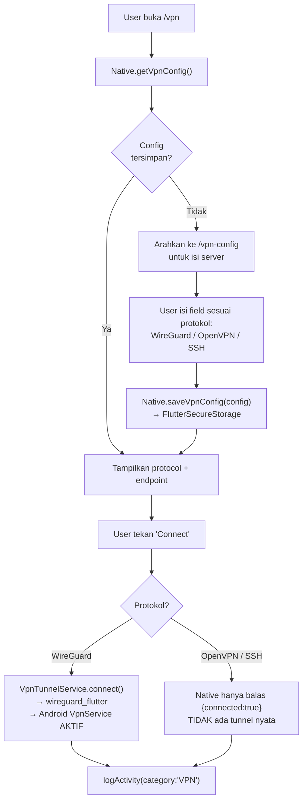

**Status: 🟡 Parsial** — WireGuard **sungguhan** (tunnel nyata via `VpnService`), OpenVPN/SSH masih **config-only** (field tersimpan, tapi tombol Connect tidak benar-benar mengalihkan trafik — aplikasi jujur menampilkan catatan ini ke user).

---

## 10. Alur Activity Log

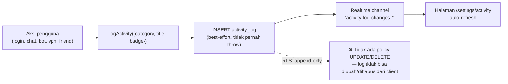

**Status: ✅ Fungsional** — insert + realtime subscription diverifikasi. Kategori: `AI`, `Agents`, `Bots`, `VPN`, `Friends`, `System`.

---

## 11. Native Bridge (Web ⇄ Flutter)

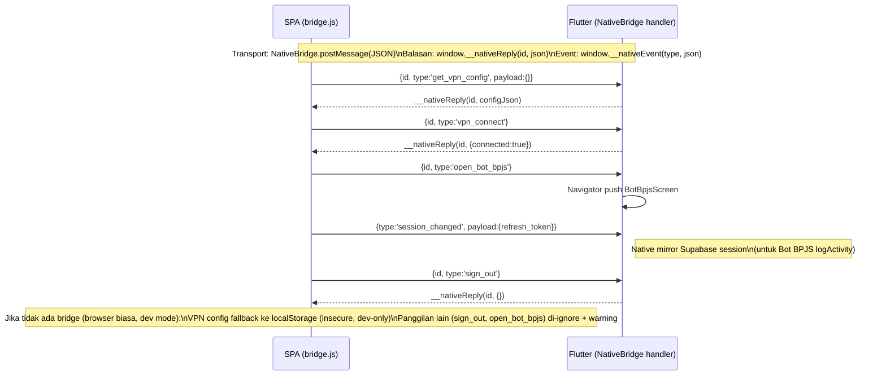

**Timeout**: setiap panggilan native punya batas 8 detik (`CALL_TIMEOUT_MS`) — jika native tidak membalas, Promise resolve `null` alih-alih menggantung selamanya.

---

## 12. Deployment

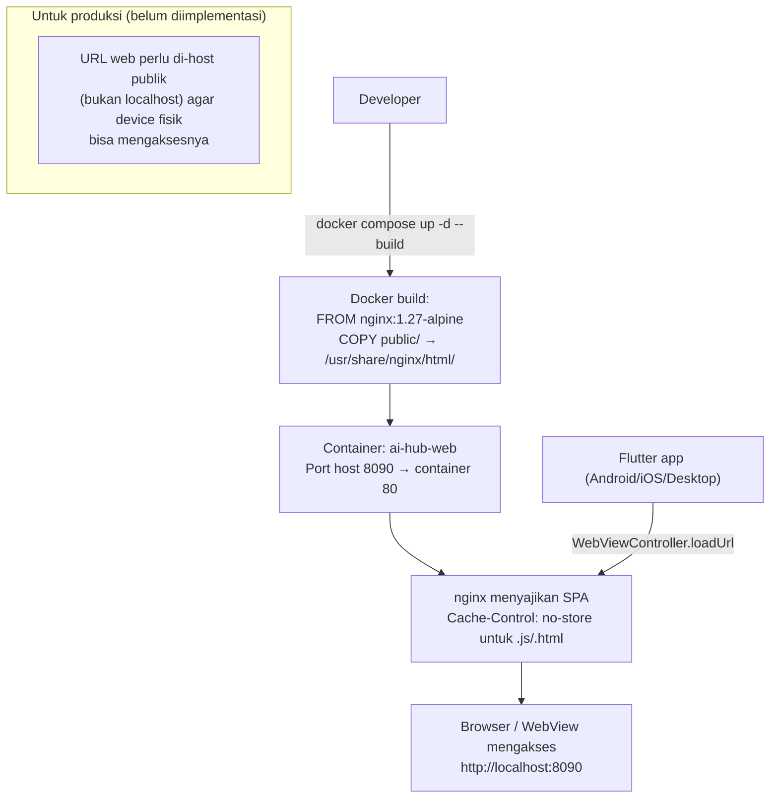

**Konfigurasi kunci `nginx.conf`:**
- `Access-Control-Allow-Origin: *` — supaya SPA bisa dibuka langsung dari browser biasa saat development (di luar WebView).
- `Cache-Control: no-store, must-revalidate` khusus file `.js`/`.html` — supaya `docker compose up --build` ulang langsung terlihat efeknya tanpa pengguna perlu hard-refresh manual.

---

## 13. Ringkasan Status Fitur

| Fitur | Status | Verifikasi |
|---|---|---|
| Login / Registrasi | ✅ Fungsional | Signup + login nyata via REST API |
| Profil (nama, role, bio) | ✅ Fungsional | Upsert diverifikasi |
| Pertemanan (cari, kirim, terima) | ✅ Fungsional | *Sempat hilang total setelah refactor 25-29 Sept, dibangun ulang 1 Okt* |
| Chat dengan provider/agent AI | 🟡 Parsial | Logic benar, butuh API key asli pengguna |
| Universal API key (deteksi otomatis) | ✅ Fungsional | Bug regex kritis ditemukan & diperbaiki |
| Kredensial terenkripsi (AES-GCM) | ✅ Fungsional | Round-trip encrypt→simpan→baca→decrypt diverifikasi sama persis |
| Bot Hub (katalog) | ✅ Fungsional | Navigasi & filter bekerja |
| **Bot BPJS — rekam suara (STT)** | ✅ Fungsional | `speech_to_text` on-device asli (baru 1 Okt 2026) |
| **Bot BPJS — pilih dokter** | ✅ Fungsional | Query friendship asli, bukan lagi hardcoded (baru 1 Okt 2026) |
| **Bot BPJS — generate dokumentasi LLM** | ✅ Fungsional | Panggil LLM native dengan kredensial terenkripsi (baru 1 Okt 2026) |
| **Bot BPJS — review dokter independen** | ✅ Fungsional | Halaman web baru, sebelumnya tidak ada sama sekali (baru 1 Okt 2026) |
| Bot BPJS — wake word pasif | 🔴 Simulasi | Terpicu tombol, bukan listening sungguhan |
| Bot BPJS — speaker diarization | 🔴 Belum ada | Butuh model terpisah |
| VPN WireGuard | ✅ Fungsional | Tunnel asli via `wireguard_flutter` |
| VPN OpenVPN/SSH | 🟡 Parsial | Config tersimpan, tunnel belum nyata |
| Activity Log | ✅ Fungsional | Insert + realtime diverifikasi |
| Agent simulasi (Code/Data/Planner Agent) | — | **Dihapus** dari desain — diganti pendekatan "agent = chip di Chat" yang lebih jujur |

### Riwayat Perbaikan Penting

| Tanggal | Temuan | Perbaikan |
|---|---|---|
| 25 Sept | Tabel `api_credentials` belum diterapkan ke DB live | Schema dijalankan manual via SQL Editor |
| 1 Okt | Pola regex OpenAI menangkap key provider lain | Negative lookahead ditambahkan, 6/6 test lolos |
| 1 Okt | Fitur Friends hilang total (tidak ada route/UI/fungsi DB) | Dibangun ulang lengkap: `db.js`, `views/friends.js`, routing |
| 1 Okt | Bot BPJS pakai 3 nama dokter hardcoded | Diganti query `fetchAcceptedDoctors()` asli |
| 1 Okt | Bot BPJS 100% simulasi (`Future.delayed`, data contoh) | STT asli, LLM call asli, simpan DB asli, halaman review dokter baru |
| 1 Okt | Konten halaman web terduplikasi vertikal | Race condition `onAuthStateChange` di `router.js`, diperbaiki dengan render-token guard |

---

*Dokumen ini mencerminkan kondisi kode pada commit `28fd897`. Untuk status paling akurat, baca langsung kode di `app/lib/` dan `web/public/` — dokumen bisa menjadi usang seiring pengembangan lanjutan.*
